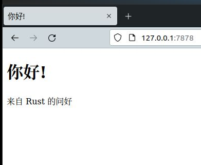

# 最后项目：构建一个多线程的 Web 服务器

**Final Project: Building a Multithreaded Web Server**


这是一个漫长的旅程，但我们已经到达了本书的结尾。在本章中，咱们将一起构建又一个项目，来演示咱们在最后这些章中，曾涉及到的一些概念，同时回顾一些较早的内容。

对于这个最后的项目，咱们将构造一个讲出 “你好”，且在浏览器中看起来如图 20-1 那样的一个 web 浏览器。




*图 20-1：咱们最后一起做的项目*

以下是构建这个 web 服务器的计划：

1. 学习一点有关 TCP 与 HTTP 方面的知识；
2. 在某个套接字上监听 TCP 连接；
3. 解析少数几个 HTTP 请求；
4. 创建出某种恰当的 HTTP 响应；
5. 运用线程池，提升咱们服务器的吞吐量。

在咱们开始动手前，咱们应注意到一个情况：咱们将运用的方法，将不会是在 Rust 下构建 web 服务器的最佳方法。在 [crates.io](https://crates.io/) 上，一些社区成员已经发布了数个，适合用于生产环境，提供了更完整功能的 web 服务器，以及咱们将要构建的线程池实现的代码箱。但是，本章中咱们的意图，是要帮助咱们学习掌握，而非走那样的捷径。由于 Rust 是门系统编程语言，因此咱们可以选择咱们打算着手的抽象层次，并可以触及到相比其他语言中，可行的或可操作的更低级别。因此咱们将亲自编写这个基本的 HTTP 服务器与线程池，如此咱们便可以学习这些代码箱之后的，今后可能会用到的一些一般概念与技巧。


## 构建一个单线程的 Web 服务器

咱们将通过让一个单线程的 web 服务器工作起来而开始。在咱们开始前，先来看看在构建 web 服务器中涉及到的一些协议的快速概览。这些协议的细节，超出了本书范围，而简要概述，就将给到咱们所需的信息。

Web 服务器中涉及的两种主要谢谢，分别是 *超文本传输协议，Hypertext Transfer Protocol, HTTP* 与 *传输控制协议，Transmission Control Protocol, TCP*。两种协议都是 *请求-响应，request-response* 的协议，表示 *客户端，client* 发起请求，而 *服务器，server* 监听到请求并提供给客户端一个响应。这些请求和响应的内容是由两种协议定义的。

TCP 是种描述了信息如何从一台服务器到达另一服务器，但并未指明信息为何的低级别。HTTP 则是经由定义请求与响应的内容，而于 TCP 之上构建的。技术上要在其他协议上使用 HTTP 是可行的，但在绝大多数情况下，HTTP 都在 TCP 上发送他的数据。咱们将在 TCP 的原始字节，与 HTTP 请求和响应下，进行工作。

### 监听 TCP 连接

**Listen to the TCP Connection**

咱们的 web 服务器需要监听某个 TCP 连接，因此那便是咱们将要做的第一部分工作。标准库提供了一个 `std::net` 模组，允许咱们完成这一点。咱们来以寻常方式构造一个新的项目：

```console
$ cargo new hello --vcs none
     Created binary (application) `hello` package
$ cd hello
```

现在请输入下面清单 20-1 中 `src/main.rs` 里的代码来开始。这段代码会在本地地址 `127.0.0.1:7878` 处监听传入的 TCP 流。当他获取到一个传入流时，他就会打印 `连接已建立！`。

文件名：`src/main.rs`

```rust
use std::net::TcpListener;

fn main() {
    let listener = TcpListener::bind("127.0.0.1:7878").unwrap();

    for stream in listener.incoming() {
        let stream = stream.unwrap();

        println! ("连接已建立！");
    }
}
```

*清单 20-1：监听传入流并在咱们接收到某个流时打印一条消息*

运用 `TcpListener`，咱们就可以在地址 `127.0.0.1:7878` 处监听 TCP 连接。在这个地址中，冒号之前的部分，是个表示咱们的计算机的 IP 地址（在所有计算机上这都是同样的，而并不特别表示本书作者的计算机），同时 `7878` 为端口。咱们之所以选择了这个端口，有两个原因：通常不是在这个端口上接收 HTTP，因此咱们的服务器，大概率不会与咱们可能在咱们的机器上运行的任何别的 web 服务器冲突，而 `7878` 则是电话机上输入的 *rust*。

这个场景中的 `bind` 函数，会像将返回一个新 `TcpListener` 实例的 `new` 函数一样工作。该函数之所以叫做 `bind`，是因为在网络通信中，连接到要监听的端口，被称为 “绑定到端口”。

`bind` 函数返回的是个 `Result<T, E>`，表明有可能绑定失败。比如，连接到端口 `80` 需要管理员权限（非管理员只可以监听高于 `1023` 的那些端口，译注：在 *nix 平台上有此限制，但在 Win 平台上没有），因此若咱们在非管理员下尝试连接到端口 `80`，端口绑定就不会工作。在比如咱们运行了这个程序的两个实例，而因此有两个程序在监听同一端口时，端口绑定也不会工作。由于咱们仅是处于学习目的，而编写的一个基本服务器，因此咱们就不会纠结于处理这些类别的错误；相反，咱们使用 `unwrap` 来在错误发生时停止这个程序。

`TcpListener` 上的 `incoming` 方法，会返回一个给到咱们流（更具体的，是一些类型 `TcpStream` 的流）序列的迭代器，an iterator that gives us a sequence of streams。单一的 *流，stream* 表示了客户端与服务器之间的一个打开的连接，an open connection。而一个 *连接，connection* 则是客户端连接到服务器过程中，完整的请求与响应的叫法，服务器会生成一个响应，且服务器会关闭这个连接。就这样，咱们将从那个 `TcpStream` 读取，来看看客户端发送了什么，并于随后把咱们的响应写到这个流，以将数据发送回客户端。总的来说，这个 `for` 循环将依次处理每个连接，并为咱们产生一系列要处理的流。

至于现在，咱们对流的处理，是由在流有任何错误时，调用 `unwrap` 来终止咱们的程序所构成；若没有任何错误，那么这个程序就会打印一条消息。在下一代码清单中，咱们将为流成功的情形，添加更多功能。在客户端连接到服务器时，咱们可能会从那个 `incoming` 方法收到错误的原因，便是咱们没有真正在一些连接上迭代。相反，咱们是在一些 *连接尝试，connection attempts* 上迭代。连接可能因为数种原因而不成功，许多的这些原因都是特定于操作系统的。比如，许多操作系统都有他们所支持的并发开启连接数限制，a limit to the number of simultaneous open connecitons；超出那个数目的新建连接尝试就会产生错误，除非一些开启的连接关闭。

咱们来尝试运行这段代码！在终端里运行 `cargo run` 并随后在 web 浏览器中加载 `127.0.0.1:7878`。由于服务器没有正确发回任何数据，因此浏览器应给出像是 `Connection reset,` 的错误消息。但当咱们看着终端时，应看到在浏览器连接到服务器时，有数条打印处的消息！

> 注：可使用 `$curl 127.0.0.1:7878` 命令进行调试，且使用 `curl` 也是网络编程调试中常用的方法。

```console
     Running `target/debug/hello`
连接已建立！
连接已建立！
连接已建立！
连接已建立！
```

有的时候，咱们会看到一次浏览器请求下打印出的多条消息；原因可能是浏览器在构造页面请求时，也会构造其他资源的请求，像是出现在浏览器 tab 分页中的 `favicon.ico` 图标。

也可由可能是由于这个服务器没有响应任何数据，浏览器因此会尝试多次连接到这个服务器。在 `stream` 超出作用域，而在那个循环结束出被丢弃时，连接就会作为 `drop` 实现的一部分而被关闭。由于故障可能是临时的，因此浏览器有时会以重试处理关闭的连接。重要的是，咱们已然成功得到了到 TCP 连接的句柄，a handle to a TCP connection！

请记得在咱们完成运行代码的特定版本时，要通过按下 `Ctrl-c` 来停止这个程序。以后在完成了各套代码修改后，要通过运行 `cargo run` 命令重启这个程序，来确保咱们是在运行最新的代码。


### 读取请求

**Reading the Request**

咱们来实现读取来自浏览器请求的功能！为将首选获取到连接，及随后对连接采取一些措施这两个关注点分离，咱们将开启一个用于处理连接的新函数。在这个新的 `handle_connection` 函数中，咱们将从 TCP 流读取数据，并将其打印出来，从而咱们就可以看到从浏览器发出的数据。请将代码修改为清单 20-2 这样。

文件名：`src/main.rs`

```rust
#![allow(warnings)]
use std::{
    io::{prelude::*, BufReader},
    net::{TcpListener, TcpStream},
};

fn main() {
    let listener = TcpListener::bind("127.0.0.1:7878").unwrap();

    for stream in listener.incoming() {
        let stream = stream.unwrap();

        handle_conn(stream);
    }
}

fn handle_conn(mut stream: TcpStream) {
    let buf_reader = BufferedReader::new(stream);
    let http_req: Vec<_> = buf_reader
        .lines()
        .map(|res| res.unwrap())
        .take_while(|line| !line.is_empty())
        .collect();

    println! ("请求：{:#?}", http_request);
}
```

*清单 20-2：从 `TcpStream` 读取并打印出数据*


咱们将 `std::io::prelude` 与 `std::io::BufReader` 带入作用域，来获取到实现从 TCP 流读取和写入的那些特质与类型的访问。在 `main` 函数的那个 `for` 循环中，不再是打印一条声称咱们已构造一个连接的消息，咱们限制调用了新的 `handle_conn` 函数，并把那个 `stream` 传递给他。

在 `handle_conn` 函数中，咱们创建了一个新的，封装着到 `stream` 的一个可变引用的 `BufReader` 实例。`BufReader` 会通过管理到 `std::io::Read` 特质一些方法的调用，为咱们添加缓冲。

咱们创建了一个名为 `http_req` 的变量，来收集浏览器发送到咱们服务器的请求的那些行。通过添加那个 `Vec<_>` 类型注解，咱们表明了咱们打算把这些行收集到一个矢量值中。

`BufReader` 实现了 `std::io::BufRead` 特质，该特质提供了 `lines` 方法。`lines` 方法会经由当其发现一个新行字节，a newline byte, 时分割数据流，而返回一个 `Result<String, std::io::Error` 的迭代器。而要获取各个 `String`，咱们就要映射，map，并 `unwrap` 各个 `Result`。若数据不是有效的 UTF-8，或从 TCP 流读取存在问题时，这个 `Result` 就可能是个错误。再次声明，生产程序应更优雅地处理这些报错，但咱们为简化目的，而选择了在错误情形下停止这个程序。

浏览器通过在一行中发送两个新行字符，发出 HTTP 请求结束信号。因此要从 TCP 流获取一次请求，咱们就要取那些直到咱们得到一个为空字符串的行为止的那些行。一旦咱们将这些行收集到那个矢量值中，咱们就用漂亮的调试格式，把他们打印处理，如此咱们就可以看看，web 浏览器正发送给咱们服务器的那些指令。

咱们来试试这段代码！启动这个程序，并再次于浏览器中构造一次请求。请注意咱们仍会在浏览器中得到一个错误页面，但终端中咱们程序的输出，现在将看起来类似于下面这样：

```console
$ cargo run
   Compiling hello v0.1.0 (file:///projects/hello)
    Finished dev [unoptimized + debuginfo] target(s) in 0.42s
     Running `target/debug/hello`
请求: [
    "GET / HTTP/1.1",
    "Host: 127.0.0.1:7878",
    "User-Agent: Mozilla/5.0 (Macintosh; Intel Mac OS X 10.15; rv:99.0) Gecko/20100101 Firefox/99.0",
    "Accept: text/html,application/xhtml+xml,application/xml;q=0.9,image/avif,image/webp,*/*;q=0.8",
    "Accept-Language: en-US,en;q=0.5",
    "Accept-Encoding: gzip, deflate, br",
    "DNT: 1",
    "Connection: keep-alive",
    "Upgrade-Insecure-Requests: 1",
    "Sec-Fetch-Dest: document",
    "Sec-Fetch-Mode: navigate",
    "Sec-Fetch-Site: none",
    "Sec-Fetch-User: ?1",
    "Cache-Control: max-age=0",
]
```


> 注：使用 `curl --noproxy '*' 127.0.0.1:7878` 的输出，如下面这样：


```console
$ cargo run
    Finished dev [unoptimized + debuginfo] target(s) in 0.00s
     Running `target/debug/hello`
请求：[
    "GET / HTTP/1.1",
    "Host: 127.0.0.1:7878",
    "User-Agent: curl/7.68.0",
    "Accept: */*",
]
```

根据咱们的浏览器，咱们可能会得到些许不同的输出。既然咱们打印了请求数据，咱们就可以通过查看请求第一行中 `GET` 之后的路径，而发现为何咱们会从一次浏览器请求，得到多个连接。若重复的连接都是在请求 `/`，咱们就知道由于浏览器没有从咱们的程序得到响应，因此其是在尝试重复获取 `/`。

下面来对这一请求数据加以细分，以搞清楚浏览器是在询问咱们的程序些什么。


### 近观 HTTP 请求

**A closer Look at an HTTP Request**


HTTP 是种基于文本的协议，而请求会采用下面这种格式：

```text
Method Request-URI HTTP-Version CRLF
headers CRLF
message-body
```

第一行是保存着有关该客户端正请求什么的信息的 *请求行，request line*。该请求行的第一部分，表示正使用的 *方法，method*，比如 `GET` 或 `POST`，描述了客户端是如何构造此请求的。咱们的客户端使用了一个 `GET` 请求，这意味着其是在询问信息。

请求行接下来的部分为 `/`，表示客户端正请求的 *同一资源标识符，Uniform Resource Identifier, URI*：URI 几乎是，但不完全与 *同一资源定位符，Uniform Resource Locator, URL* 一样。URIs 与 URLs 之间的区别对于这章中咱们的目的不重要，但 HTTP 的规格使用了 URI 这个词，因此咱们只能在此处暗自用 URL 代替 URI。

最后部分是客户端所用的 HTTP 版本，而随后这个请求行便以一个 *CRLF 序列，CRLF sequence* （CRLF 代表的是 *回车，carriage return* 与 *换行，line fedd*，是打字机时代的术语！）结束了。这个 CRLF 序列还可以写作 `\r\n`，其中的 `\r` 是个回车，而 `\n` 是个换行。CRLF 序列将请求行与其余的请求数据分开。请注意当 CRLF 被打印时，咱们会看到一个新行开始，而非 `\r\n`。

查看如今咱们从运行这个程序所接收到的请求行数据，咱们发现 `GET` 即为请求方法，`/` 便是请求的 URI，而 `HTTP/1.1` 则是请求的 HTTP 版本。

在请求行之后，从 `Host:` 开始的其余那些行，就是些头了。`GET` 请求没有请求体。

请从不同浏览器构造请求，或是询问不同地址，比如 `127.0.0.1:7878/test`，来发现请求数据会怎样变化。

> 注：运行 `curl --noproxy '*' 127.0.0.1:7878/test` 时，请求数据如下所示：


```console
请求：[
    "GET /test HTTP/1.1",
    "Host: 127.0.0.1:7878",
    "User-Agent: curl/7.68.0",
    "Accept: */*",
]
```

既然咱们明白了浏览器是在询问什么，下面就来发回一些数据吧！


### 写下响应

**Writing a Response**

咱们将要实现发送响应客户端请求数据。响应有着下面的格式：

```text
HTTP-Version Status-Code Reason-Phrase CRLF
headers CRLF
message-body
```

其中第一行是包含在响应中用到的 HTTP 版本的 *状态行，status line*、汇总了请求结果的一个数字的状态码、以及提供了状态码文字描述的一个原因短语，a reason phrase。在那个 CRLF 之后是一些 HTTP 头、另一个 CRLF 序列、及响应的响应体。

下面就是一个使用了 HTTP 版本 1.1 的示例响应，有着状态码 `200`、一个 `OK` 的原因短语、没有头部、也没有响应体。

```text
HTTP/1.1 200 OK\r\n\r\n
```

状态代码 `200` 是标准的成功响应。这个文本便是个极小的成功 HTTP 响应。下面来把这个响应，作为咱们到成功请求的响应，写到 TCP 流！在那个 `handle_conn` 函数中，移除曾是打印请求数据的 `println!`，而将其替换为下面清单 20-3 中的代码。

文件名：`src/main.rs`

```rust
fn handle_conn(mut stream: TcpStream) {
    let buf_reader = BufReader::new(&mut stream);
    let http_req: Vec<_> = buf_reader
        .lines()
        .map(|res| res.unwrap())
        .take_while(|line| !line.is_empty())
        .collect();

    let resp = "HTTP/1.1 200 OK\r\n\r\n";

    stream.write_all(resp.as_bytes()).unwrap();
}
```

*清单 20-3：将一个极小的成功 HTTP 响应写到 TCP 流*

那第一行定义了保存成功消息数据的 `resp` 变量。随后咱们在咱们的 `resp` 上调用 `as_bytes`，将字符串数据转换为一些字节。`stream` 上的 `write_all` 方法，会取一个 `&[u8]` 并将那些字节直接发送到 TCP 连接。由于 `write_all` 操作可能失败，咱们就像前面一样，于任何的错误结果上使用 `unwrap`。再次，在真实应用中，咱们会在这里加上错误处理。

有了这些修改，咱们来运行咱们的代码，并构造一次请求。咱们就不再打印任何数据到终端，因此咱们不会看到除 Cargo 的输出外，其他任何的输出。当咱们在 web 浏览器中加载 `127.0.0.1:7878` 时，咱们应得到一个空白页而非报错。咱们刚刚已经硬编码了接收 HTTP 请求并发送一次响应了！


### 返回真正的 HTML

**Returning Real HTML**

下面来实现返回相比空白页更多内容的功能。请在咱们的项目目录根处，而非 `src` 目录中创建一个新文件 `hello.html`。咱们可放入任何咱们想要的 HTML；下面清单 20-4 给出了一种可能。

文件名：`hello.html`

```html
<!DOCTYPE html>
<html lang="en">
  <head>
    <meta charset="utf-8">
    <title>你好!</title>
  </head>
  <body>
    <h1>你好!</h1>
    <p>来自 Rust 的问好</p>
  </body>
</html>
```

*清单 20-4：要在响应中返回的一个样例 HTML 文件*

这是个带有一个与一些文本的最小 HTML5 文档。要在收到一个请求时从服务器返回这个文档，咱们将如下清单 20-5 中所示那样，修改 `handle_conn` 来读取这个 HTML 文件，将其作为响应体，添加到一个响应，并将其发送。

文件名：`src/main.rs`

```rust
#![allow(warnings)]
use std::{
    fs,
    io::{prelude::*, BufReader},
    net::{TcpListener, TcpStream},
};

fn main() {
    let listener = TcpListener::bind("127.0.0.1:7878").unwrap();

    for stream in listener.incoming() {
        let stream = stream.unwrap();

        handle_conn(stream);
    }
}

fn handle_conn(mut stream: TcpStream) {
    let buf_reader = BufReader::new(&mut stream);
    let http_req: Vec<_> = buf_reader
        .lines()
        .map(|res| res.unwrap())
        .take_while(|line| !line.is_empty())
        .collect();

    let status_line = "HTTP/1.1 200 OK";
    let contents = fs::read_to_string("hello.html").unwrap();
    let length = contents.len();

    let resp =
        format! ("{status_line}\r\nContent-Length: {length}\r\n\r\n{contents}");

    stream.write_all(resp.as_bytes()).unwrap();
}
```

*清单 20-5：将 `hello.html` 的内容作为响应的响应体发送*

咱们已添加 `fs` 到那个 `use` 语句，来将标准库的文件系统模组带入到作用域中。把文件内容读取到一个字符串的代码应看起来不陌生；在第 12 章，于清单 12-4 中为咱们的 I/O 项目读取一个文件的内容时，咱们曾用到过他。

接下来，咱们使用了 `format!` 宏，来将那个文件的内容，添加为这个成功响应的响应体。为确保一个有效的 HTTP 响应，咱们添加了被设置为咱们的响应体大小的一个 `Content-Length` 头部，在这个示例中就是 `hello.html` 的大小。

以 `cargo run` 运行这段代码，并在浏览器中加载 `127.0.0.1:7878`；咱们应看到咱们的 HTML 被渲染了！

目前，咱们忽略了 `http_req` 中的响应数据，而只是无条件地发回那个 HTML 文件的内容。那就意味着当咱们在浏览器中尝试请求 `127.0.0.1:7878/something-else` 时，咱们将仍然得到这同样的 HTML 响应。此刻，咱们的服务器是非常有限的，且不会完成绝大多数 web 服务器所完成的那些事情。咱们打算根据请求定制咱们的响应，并只为格式良好的到 `/` 请求，发回这个 HTML 文件。


### 对请求加以验证并有选择地进行响应

**Validating the Request and Selectively Responding**

现在，咱们的 web 服务器将始终返回那个文件中的 HTML，而不管客户端请求的是什么。下面来添加在返回那个 HTML 文件前，检查浏览器是在请求 `/`，并在浏览器请求其他路径时，返回一个错误的功能。为此，咱们需要如下面清单 20-6 中所示的那样修改 `handle_conn`。这段新代码会将收到的请求，与咱们所知的 `/` 请求看起来的样子对比检查，并添加了 `if` 及 `else` 代码块来分别对待各种请求。

文件名：`src/main.rs`

```rust
fn handle_conn(mut stream: TcpStream) {
    let buf_reader = BufReader::new(&mut stream);
    let req_line = buf_reader.lines().next().unwrap().unwrap();

    if req_line == "GET / HTTP/1.1" {
        let status_line = "HTTP/1.1 200 OK";
        let contents = fs::read_to_string("hello.html").unwrap();
        let length = contents.len();

        let resp =
            format! ("{status_line}\r\nContent-Length: {length}\r\n\r\n{contents}");

        stream.write_all(resp.as_bytes()).unwrap();
    } else {
        // 别的一些请求
    }
}
```

*清单 20-6：以不同于其他请求方式，处理到 `/` 的请求*

咱们只打算看看 HTTP 请求的第一行，因此就不再将整个请求读取到一个矢量值了，咱们调用了 `next` 来从那个迭代器得到第一个条目。这里的首个 `unwrap` 会注意其中的 `Option`，并在迭代器没有条目时停止这个程序。第二个 `unwrap` 则会处理其中的 `Result`，并与清单 20-2 中所添加的 `map` 里的那个 `unwrap` 有着同样的效果。

接下来，咱们检查了 `req_line`，来看看其是否等于到 `/` 路径 `GET` 请求的请求行。在其等于时，那个 `if` 代码块就会返回咱们 HTML 文件的内容。

若 `req_line` *不* 等于到 `/` 路径 `GET` 请求的第一行时，就意味着咱们收到了一些别的请求。稍后咱们将添加代码到那个 `else` 代码块，来响应全部其他请求。

现在请运行此代码，并请求 `127.0.0.1:7878`；咱们应获取到 `hello.html` 中的 HTML。在咱们构造任何其他请求时，比如 `127.0.0.1:7878/something-else`，就将得到像是咱们曾在运行清单 20-1 及清单 20-2 中的代码时，所看到连接错误。

现在来将清单 20-7 中的代码，添加到那个 `else` 代码块，以返回一个带有状态代码 `404` 的响应，这通告了请求的内容未找到。咱们还将返回一些在浏览器中要渲染页面的 HTML，将这种响应表示给终端用户。

文件名：`src/main.rs`

```rust
    // --跳过代码--
    } else {
        let status_line = "HTTP/1.1 404 NOT FOUND";
        let contents = fs::read_to_string("404.html").unwrap();
        let length = contents.len();

        let resp =
            format! ("{status_line}\r\nContent-Length: {length}\r\n\r\n{contents}");

        stream.write_all(resp.as_bytes()).unwrap();
    }
```

*清单 20-7：在请求的是除 `/` 外的其他路径时以状态代码 `404` 及一个错误页面进行响应*

此处，咱们的响应有着一个代码状态代码 `404`，及原因短语 `NOT FOUND` 的状态行。该响应的响应体，将是文件 `404.html` 中的 HTML。咱们将需要创建 `hello.html` 旁边，用于错误页面的 `404.html` 文件；请再次随意使用咱们想要的任何 HTML，或使用下面清单 20-8 中的示例 HTML。

文件名：`404.html`

```html
<!DOCTYPE html>
<html lang="en">
  <head>
    <meta charset="utf-8">
    <title>你好!</title>
  </head>
  <body>
    <h1>糟糕!</h1>
    <p>抱歉，我不明白你要什么。</p>
  </body>
</html>
```

*清单 20-8：全部 404 响应下要发回页面的示例内容*

在这些修改下，请再次运行咱们的服务器。请求 `127.0.0.1:7878` 应返回 `hello.html` 的内容，而任何别的请求，像是 `127.0.0.1:foo`，就应返回 `404.html` 中的报错 HTML。


### 初试重构

*A Touch of Refactoring*


此时的 `if` 与 `else` 两个代码块，有着很多重复：他们都在读取文件及将文件内容写到 TCP 流。唯二区别就是响应的状态行与文件名。下面就来通过抽取处这些差异到单独的 `if` 和 `else` 行，这些行将把响应状态行与文件名，赋值给两个变量；随后咱们就可以在代码中，不带条件地使用这两个变量，来读取文件并写下响应。下面清单 20-9 给出了替换了大段的 `if` 与 `else` 代码块后的最终代码。

文件名：`src/main.rs`

```rust
// --跳过代码--
fn handle_conn(mut stream: TcpStream) {
    let buf_reader = BufReader::new(&mut stream);
    let req_line = buf_reader.lines().next().unwrap().unwrap();

    let (status_line, filename) = if req_line == "GET / HTTP/1.1" {
        ( "HTTP/1.1 200 OK", "hello.html")
    } else {
        ("HTTP/1.1 404 NOT FOUND", "404.html")
    };

    let contents = fs::read_to_string(filename).unwrap();
    let length = contents.len();

    let resp =
        format! ("{status_line}\r\nContent-Length: {length}\r\n\r\n{contents}");

    stream.write_all(resp.as_bytes()).unwrap();
}
```

*清单 20-9：将 `if` 和 `else` 代码块重构为只包含两种情况下不同的代码*

现在 `if` 与 `else` 两个代码块，就只会返回一个元组中，响应状态行与文件名的相应值了；随后咱们运用第 18 章中曾讨论过的 `let` 语句中的模式，而使用了解构特性，来将这两个值复制给 `status_line` 与 `filename`。

原先那些重复代码，现在便是在 `if` 与 `else` 两个代码块外面，并使用了 `status_line` 与 `filename` 两个变量。这令到看出两种情况之间的差别更为容易，并意味着在咱们打算修改文件读取与响应写入工作方式时，只有一处要更新代码。清单 20-9 中代码的行为，将与清单 20-8 中的一致。

相当棒！现在咱们就有了一个以差不多 40 行 Rust 代码编写的，以一个内容页面响应一个到 `/` 的请求，并以一个 `404` 响应回应全部其他请求的简单 web 服务器了。

当前，咱们的服务器是运行在单线程下的，意味着其只能一次服务一个请求。接下来就要通过模拟一下低速请求，检查那怎样会称为一个问题。随后咱们将修复这个问题，从而让咱们的服务器可以一次处理多个请求。


## 将咱们的单线程服务器改写为多线程服务器

**Turning Our Single-Thread Server into a Multithreaded Server**

现在，这个服务器将依次处理每个请求，这意味着其将不会在前一个连接完成处理前，处理后一连接。若服务器收到了越来越多的请求，这种顺序执行就会越来越差。而若该服务器收到了一个要耗费较长时间处理的请求，即使后续的新请求可被快速处理，但其仍将不得不等待直到那个长时间请求完成。咱们需要修复这个问题，但首选，咱们将具体看看这个问题。


### 在当前服务器实现下模拟一个慢速请求

**Simulating a Slow Request in the Current Server Implemenation**

咱们将看看一个慢速处理的请求，能怎样影响那些到咱们当前服务器实现的其他请求。下面清单 20-10 以一个将导致服务器在响应前睡眠 5 秒的模拟慢速请求，实现了对到 `/sleep` 请求的处理。

文件名：`src/main.rs`

```rust
#![allow(warnings)]
use std::{
    fs,
    io::{prelude::*, BufReader},
    net::{TcpListener, TcpStream},
    thred,
    time::Duration,
};
// --跳过代码--

fn handle_conn(mut stream: TcpStream) {
    // --跳过代码--

    let (status_line, filename) = match &req_line[..] {
        "GET / HTTP/1.1" => ( "HTTP/1.1 200 OK", "hello.html"),
        "GET /sleep HTTP/1.1" => {
            thread::sleep(Duration::from_secs(5));
            ("HTTP/1.1 200 0K", "hello.html")
        }
        _ => ("HTTP/1.1 404 NOT FOUND", "404.html"),
    };

    // --跳过代码--
}
```

*清单 20-10：通过睡眠 5 秒模拟慢速请求*

现在咱们有了三种情况，于是就已从 `if` 切换到了 `match`。咱们需要显式地在 `req_line` 切片上，与那三个字符串字面值进行模式匹配；`match` 不会像相等比较方式所做的那样，执行自动引用与解引用。

首条支臂与清单 20-9 的 `if` 代码块是一样的。第二条支臂，是将请求与 `/sleep` 匹配。在收到那个请求时，服务器将在渲染那个成功 HTML 页面之前，睡眠 5 秒。第三支臂则与清单 20-9 的那个 `else` 代码块是一样的。

咱们可以看出，咱们的服务器有多原始：真正的库将以一种不那么冗长的方式，处理多种请求的识别！

请使用 `cargo run` 启动服务器。随后打开两个浏览器窗口：一个用于 `http://127.0.0.1/7878`，另一个用于 `http://127.0.0.1:7878/sleep`。若咱们像之前一样进入那个 `/` URI 几次，咱们将看到其响应很快。但在进入 `/sleep` 并于随后加载 `/` 时，就会看到那个 `/` 会一直等待，知道 `sleep` 已经于加载之前睡眠了 5 秒。

咱们可以用来避免慢速请求后面那些请求滞后的技巧有多种；咱们将实现的技巧，便是线程池。


