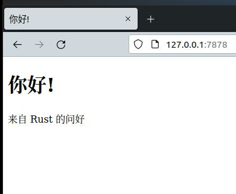

# 最终项目：构建多线程的 Web 服务器

这是一个漫长的旅程，但我们已经走到了本书的尾声。在这一章中，我们将一起构建又一个项目，来演示我们在最后几章中涉及的一些概念，并回顾之前的课程内容。

对于我们的最终项目，我们将构造一个 web 服务器，他会在 web 浏览器中显示 “你好！”，看起来如下图 20-1 中那样。

以下是我们构建 web 服务器的计划：

1. 了解一些有关 TCP 与 HTTP 的知识；
2. 监听套接字上的 TCP 连接；
3. 解析少量 HTTP 请求；
4. 创建正确的 HTTP 响应；
5. 通过线程池提升服务器的吞吐量。

**图 20-1**：我们最后一个合作项目

在开始之前，我们需要说明两点。我们将使用的方法并非用 Rust 构建 web 服务器的最佳方式。社区成员已在 [crates.io](https://crates.io/) 上发布许多可用于生产环境的代码箱，他们提供了比我们构建的更完善的 web 服务器和线程池实现。然而，这一章中我们的目的是要帮助咱们学习，而非走捷径。正因为 Rust 是一门系统编程语言，所以我们可以自有选择想要的抽象级别，并能够深入到比其他语言所能达到或实际可行的更底层。

其次，我们不会在这里使用异步和等待。构建线程池本身已经是一项不小的挑战，无需再额外构建异步运行时！不过，我们会指出异步和等待可能会如何应用于，我们将在本章中看到的一些同样问题。最终，正如我们在第 17 章中提到的，许多异步运行时都使用线程池来管理其工作。

因此，我们将手动编写基本的 HTTP 服务器和线程池，以便咱们可以了解今后咱们可能用到的库背后的一般思路和技术。
