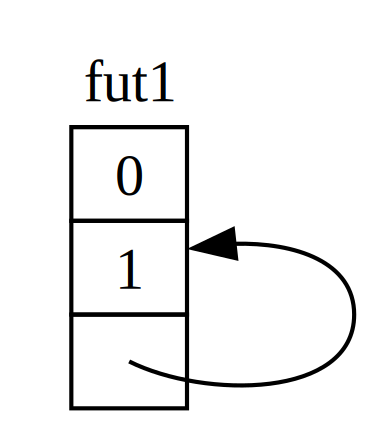

# 近观异步有关的特质


在本章中，我们以各种方式用到了 `Future`、`Pin`、`Unpin`、`Stream` 及 `StreamExt` 等特质。不过，到目前为止，我们还没有深入探讨他们的工作原理，或他们相互配合的细节，这对咱们日常的 Rust 工作来说，在大多数情况下是没有问题的。但有时，咱们将遇到需要了解更多细节的情况。在这个小节中，我们将涉足这些细节，以便在那些情形下有所帮助，而 *真正的* 深入探讨，则留给其他文档。


## `Future` 特质

我们来先仔细看看 `Future` 这个特质是如何工作的。下面是 Rust 对他的定义：


```rust
use std::pin::Pin;
use std::task::{Context, Poll};

pub trait Future {
    type Output;

    fn poll(self: Pin<&mut Self>, cx: &mut Context<'_>) -> Poll<Self::Output>;
}
```


该特质定义包含了许多新类型，以及一些我们以前从未见过的语法，因此我们来逐一了解一下该定义。


首先，`Future` 关联的类型 `Output`，指出了该未来值会解析为什么。这类似于 `Iterator` 特质关联的类型 `Item`。其次，`Future` 还有着 `poll` 方法，该方会取一个特殊的 `Pin` 引用，作为其 `slef` 参数，以及一个到 `Context` 类型的可变引用，并返回一个 `Poll<Self::Output>`。稍后我们将进一步讨论 `Pin` 与 `Context`。现在，我们着重于该方法会返回什么，即那个 `Poll` 类型：


```rust
enum Poll<T> {
    Ready(T),
    Pending,
}
```

这个 `Poll` 类型类似于 `Option`。他有个有值的变种，即 `Ready(T)`，还有个没有值的变种 `Pending`。不过，`Poll` 所指的内容与 `Option` 完全不同！`Pending` 变种表示这个未来值仍有工作要做，所以调用者将需要稍后再检查。`Ready` 变种表示该未来值已完成其工作，`T` 值可用。


> **注意**：对于大多数未来值，调用者都不应在该未来值返回 `Ready` 后，再次调用 `poll`。若在就绪后再次轮询，许多未来值都将出现不会恢复错误。再次轮询安全的未来值，会在其文档中明确说明。这与 `Iterator::next` 的行事方式类似。


当咱们看到使用了 `await` 的代码时，Rust 会在背后将其编译为调用 `poll` 的代码。回顾 [清单 17-4](futures.md#listing-17-4)，其中我们曾打印出单个 URL 解析后的页面标题，Rust 就会将其编译成类似（但不完全）下面这样的代码：


```rust
match page_title(url).poll() {
    Ready(page_title) => match page_title {
        Some(title) => println!("The title for {url} was {title}"),
        None => println!("{url} had no title"),
    }
    Pending => {
        // But what goes here?
    }
}
```

在未来值仍为 `Pending` 时，我们该怎么办？我们需要某种一次又一次尝试，直到这个未来值最终就绪的方法。换句话说，我们需要一个循环：


```rust
let mut page_title_fut = page_title(url);

loop {
    match page_title_fut.poll() {
        Ready(value) => match page_title {
            Some(title) => println!("The title for {url} was {title}"),
            None => println!("{url} had no title"),
        }
        Pending => {
            // continue
        }
    }
}
```


如果 Rust 将其编译成这样的代码，那么每个 `await` 都会阻塞 -- 这与我们的目标正好背道而驰！相反，Rust 会确保这个循环可将控制权交给某个，可暂停这个未来值上的工作，转而处理其他未来值，并在稍后再次检查这个未来值的东西。正如我们所见，这个东西就是异步运行时，而这种调度和协调工作，正是他的主要工作之一。


在本章早些时候，我们介绍了 `rx.recv` 上的等待。`recv` 调用会返回一个未来值，并等待这个未来值轮询他。我们曾注意到，直到在通道关闭，未来值以 `Some(message)` 或 `None` 就绪前，运行时都将暂停该未来值。随着我们对 `Future` 这个特质，特别是 `Future::poll` 这个方法的深入理解，我们就能明白其工作原理。当未来值返回 `Poll::Pending` 时，运行时就知道这个未来值未就绪。反之，当 `poll` 返回 `Poll::Ready(Some(message))` 或 `Poll::Ready(None)` 时，运行时就知道该未来值 *为* 就绪，并将其向前推进。


运行时如何做到这点的具体细节，超出了本书的范围，但关键是要了解未来值的基本机制：运行时会 *轮询* 他所负责的每个未来值，当未来值未就绪时，运行时会让该未来值重新进入休眠状态。


## `Pin` 与 `Unpin` 特质


当我们在 [清单 17-16](./multiple_futures.md#listing-17-16) 中引入 “固定” 这个概念时，我们遇到了一个非常棘手的错误消息。下面是其中的相关部分：


```console
error[E0277]: `{async block@src/main.rs:10:23: 10:33}` cannot be unpinned
  --> src/main.rs:48:33
   |
48 |         trpl::join_all(futures).await;
   |                                 ^^^^^ the trait `Unpin` is not implemented for `{async block@src/main.rs:10:23: 10:33}`
   |
   = note: consider using the `pin!` macro
           consider using `Box::pin` if you need to access the pinned value outside of the current scope
   = note: required for `Box<{async block@src/main.rs:10:23: 10:33}>` to implement `Future`
note: required by a bound in `futures_util::future::join_all::JoinAll`
  --> file:///home/.cargo/registry/src/index.crates.io-1949cf8c6b5b557f/futures-util-0.3.30/src/future/join_all.rs:29:8
   |
27 | pub struct JoinAll<F>
   |            ------- required by a bound in this struct
28 | where
29 |     F: Future,
   |        ^^^^^^ required by this bound in `JoinAll`
```


这条错误消息不仅告诉我们需要固定这些值，还告诉我们为什么需要固定。`trpl::join_all` 这个函数会返回一个名为 `JoinAll` 的结构体。该结构体是个 `F` 类型的泛型，而 `F` 类型被约束到实现 `Future` 这个特质。以 `await` 直接等待某个未来值，就会隐式地固定这个未来值。这就是我们不需要在所有我们需要等待未来值的地方，使用 `pin!` 的原因。


不过，我们并没有在这里直接等待某个未来。相反，通过向 `join_all` 函数传递一个未来值的集合，我们构建了一个新未来值，即 `JoinAll`。`join_all` 的函数签名，要求该集合中所有项目的类型，都要实现了 `Future` 特质，而只有当取封装的 `T` 是个实现了 `Unpin` 特质的未来值时，`Box<T>` 才实现了 `Future`。


要理解的东西还真不少！为了真正理解他，我们来进一步深入了解 `Future` 这个特质的具体工作原理，尤其是与 *固定* 有关的部分。


再看看这个 `Future` 特质的定义：


```rust
use std::pin::Pin;
use std::task::{Context, Poll};

pub trait Future {
    type Output;

    // Required method
    fn poll(self: Pin<&mut Self>, cx: &mut Context<'_>) -> Poll<Self::Output>;
}
```

其中的 `cx` 参数及其 `Context`类型，是运行时在保持懒惰的同时，如何具体知道何时检查任何给定未来值的关键。同样，如何工作的细节，超出了本章的讨论范围，咱们通常只有在编写某个定制的 `Future` 实现时，才需要考虑这个问题。我们将重点关注 `self` 的类型，因为这是我们第一次看到某个方法中 `self` 有着类型注解。`self` 的类型注解，与其他函数参数的类型注解一样，但有两个关键区别：


- 他告诉 Rust，要调用方法的 `self` 必须是何类型；
- 他不能是任何类型。他被限制在该方法所实现的类型、指向该类型的引用或灵巧指针，或封装了指向该类型引用的一个 `Pin`。


我们将在 [第 18 章](../Ch17_Object_Oriented_Programming_Features_of_Rust.md) 详细介绍这种语法。现在，我们只需知道，在咱们打算轮询某个未来值，检查他是 `Pending` 还是 `Ready(Output)` 时，我们需要一个指向该类型的 `Pin` 封装的可变引用。

`Pin` 是个对诸如 `&`、`&mut`、`Box` 及 `Rc` 等指针类型的封装器。(技术上讲，`Pin` 可以与实现了 `Deref` 或 `DerefMut` 特质的类型一起工作，不过这实际上等同于只与指针一起工作。）`Pin` 本身并非指针，也不像带有引用计数的 `Rc` 与 `Arc` 那样，有任何其自身的行为；他纯粹是个编译器可用于强制约束指针使用的工具。


回顾 `await` 是通过到 `poll` 的调用实现的，这就可以解释我们早先看到的错误消息，但那是指 `Unpin` 而不是 `Pin`。那么 `Pin` 与 `Unpin` 到底有什么关系，为什么 `Future` 需要 `self` 位于某个 `Pin` 类型中，才能调用 `poll` 呢？


还记得在本章前面的内容中，在某个未来值中的一系列等待点，都会被编译到一个状态机中，且编译器会确保该状态机遵循 Rust 有关安全性的所有一般规则，包括借用及所有权。为实现这一点，Rust 会查看从一个等待点，与下一等待点或异步代码块结束处间，需要哪些数据。然后他会在编译后的状态机中，创建相应变种。无论是通过获取该数据的所有权，还是通过获取数据的可变或不可变引用，每个变种都会获得，其所需的对将在源代码该部分中用到数据的访问权。


到目前为止，一切都很好：当我们在某个给定异步代码块中的所有权或引用上有任何错误时，借用检查器就将告诉我们。当我们要绕过与该代码块对应的未来值 -- 比如将其迁移到某个 `Vec` 中，以传递给 `join_all` -- 事情就变得棘手了。


当我们迁移某个未来值 -- 无论是将其压入某个数据结构，以 `join_all` 用作迭代器，还是从函数中返回他 -- 这实际上意味着迁移 Rust 为我们创建的那个状态机。与 Rust 中的大多数其他类型不同，Rust 为异步代码块创建的未来值，最终会在任何给定变种的字段中，以到他们自身的引用结束，如图 17-4 中的简化插图所示。





*图 17-4：一种自引用的数据类型*


但在默认情况下，任何有着对自身引用的对象，在迁移时都不安全，因为引用总是指向其所引用对象的具体内存地址（见图 17-5）。若咱们迁移该数据结构本身，这些内部引用将仍旧指向旧位置。但是，该内存位置现在是无效的。首先，当咱们更改该数据结构时，他的值不会更新。更重要的是，计算机现在可以将该内存，重新用于其他目的！咱们可能会在最后读到完全无关的数据。


*图 17-5：迁移某个自引用数据类型的不安全结果*


理论上，Rust 编译器可以尝试在对象被迁移时，更新该对象的每个引用，但这会增加大量的性能开销，尤其是当整个引用网络需要更新时。如果我们能确保相关数据结构 *不会在内存中迁移*，我们就不必更新任何引用。这正是 Rust 的借用检查器所要求的：在安全的代码中，他会阻止咱们迁移任何有活动引用的项目。


`Pin` 就是建立在此基础上，为我们提供了我们所需的确切保证。当我们通过将某个到该值的指针，封装在 `Pin` 中，而 *固定* 了某个值时，该值就不再可迁移了。因此，若咱们有着 `Pin<Box<SomeType>>` 时，咱们实际上固定了这个 `SomeType` 的值，而 *不是*  那个 `Box` 指针。图 17-6 演示了这一过程。


*图 17-6：固定某个指向一个自引用未来值类型的 `Box`*


事实上，这个 `Box` 指针仍然可以自由迁移。请记住：我们关心的是，确保那个最终被引用的数据保持在原处。如果某个指针四处迁移，*但其指向的数据仍在原处*，如图 17-7 所示，就不会有潜在问题。（作为一个独立练习，请查看这些类型及 `std::pin` 这个模块的文档，并尝试解决咱们应如何以封装了某个 `Box` 的 `Pin`，实现这点。）关键在于，自引用类型本身不能迁移，因为他仍被固定着。


*图 17-7：迁移指向某个自引用未来值类型的 `Box`*


不过，大多数类型都可以安全地迁移，即使他们碰巧位于某个 `Pin` 封装器之下。只有当项目有着内部引用时，我们才需要考虑固定。诸如数字及布尔值的原生值是安全的，因为他们显然没有任何的内部引用。咱们在 Rust 中用到的大多数类型也是如此。例如，咱们可随意迁移某个 `Vec`，而不必担心。仅就我们目前所见，如果咱们有个 `Pin<Vec<String>>`，咱们就必须通过 `Pin` 提供的安全但限制性的 API，完成所有操作，尽管在没有到其的其他引用下，移动 `Vec<String>` 总是安全的。我们需要一种告诉编译器，在这种情况下移动项目是安全的方式 -- 这就是 `Unpin` 发挥作用的地方。


`Unpin` 是个标记性特质，类似于我们在第 16 章中看到的 [`Send` 与 `Sync` 特质](../concurrency/extensible_concurrency.md)，因此本身没有任何功能。标记性特质的存在，只是为了告诉编译器，在特定上下文中使用实现了某个给定特质的类型是安全的。`Unpin` 告知编译器，某个给定类型 *不* 需要对相关值是否可以安全移动做出任何保证。


与 `Send` 与 `Sync` 一样，编译器会为所有能证明其安全的类型，自动实现 `Unpin`。与 `Send` 与 `Sync` 类似的一种特殊情况是，`Unpin` *未* 对某一类型而被实现。这种情况的记法为 `impl !Unpin for SomeType`，其中，`SomeType` 是某个指向该类型的指针被用于某个 `Pin` 中时，*确实* 需要保证安全的类型名字。


换句话说，关于 `Pin` 与 `Unpin` 之间的关系，有两点需要注意。首先，`Unpin` 属于 “正常” 情况，而 `!Unpin` 是特殊情况。其次，只有在使用像是 `Pin<&mut SomeType>` 等指向某个类型的固定指针时，该类型实现 `Unpin` 还是 `!Unpin` *才* 有意义。


为具体说明这点，请设想某个 `String`：他有着一个长度，以及组成他的一些 Unicode 字符。我们可将某个 `String` 封装在某个 `Pin` 中，如图 17-8 所示。然而，与 Rust 中的大多数其他类型一样，`String` 会自动实现 `Unpin`。


*图 17-8：固定某个 `String`；虚线表示这个 `String` 实现了 `Unpin` 特质，因此其未被固定*


因此，在 `String` 实现了 `!Unpin` 时，我们就可以执行原本非法的一些事情，例如以一个字符串，替换图 17-9 中内存里完全同一位置的另一字符串。这并不违反 `Pin` 的合约，因为 `String` 没有令其迁移不安全的内部引用！这正是他实现 `Unpin` 而不是 `!Unpin` 的原因。


*图 17-9：在内存中以一个完全不同的 `String` 替换 `String`*


现在我们知道了理解 [清单 17-17](./multiple_futures.md#listing-17-17) 中，`join_all` 调用所报出错误的足够信息。我们最初尝试将异步代码块产生的未来值，迁移到某个 `Vec<Box<dyn Future<Output = ()>>>` 中，但正如我们所见，这些未来值可能有内部引用，因此他们无法实现 `Unpin`。他们需要被固定下来，然后我们就可以将 `Pin` 类型，传递到 `Vec` 中，确保这些未来值中的底层数据，不会被迁移。


`Pin` 和 `Unpin` 对于构建底层库或，或在咱们构建运行时本身很重要，而不是对日常的 Rust 代码很重要。不过，当咱们在错误消息中看到这些特质时，现在咱们就能更好地知道，如何修复咱们的代码了！


> **注意**：`Pin` 和 `Unpin` 的结合，使得在 Rust 中安全地实现一整类复杂类型成为可能，否则这些复杂类型就会因为自引用而具有挑战性。目前，需要 `Pin` 的类型最常见于异步的 Rust 中，但偶尔咱们也会在其他上下文中看到他们。
>
> `std::pin` 的 API 文档中，详细介绍了 `Pin` 和 `Unpin` 的工作原理，以及他们需要遵守的规则，因此如果咱们有兴趣了解更多，可以从这里开始。
>
> 如果咱们想更详细地了解表象之下的工作原理，请参阅 [《Rust 中的异步编程》](https://rust-lang.github.io/async-book/) 的 [第 2 章](https://rust-lang.github.io/async-book/02_execution/01_chapter.html) 和 [第 4 章](https://rust-lang.github.io/async-book/04_pinning/01_chapter.html)。


## `Stream` 特质


现在咱们已经对 `Future`、`Pin` 和 `Unpin` 三个特质有了更深入了解，我们可以将注意力转向 `Stream` 这个特质。正如咱们在本章前面所了解的，流类似于异步的迭代器。然而，与 `Iterator` 及 `Future` 不同的是，在本文档编写时，`Stream` 在标准库中还没有定义，但在整个生态系统中用到的 `futures` 代码箱中，*有* 个非常普遍的定义。


我们来先回顾一下 `Iterator` 及 `Future` 两个特质的定义，然后再看 `Stream` 特质如何将二者合并在一起。从 `Iterator` 中，我们获得了序列的概念：他的 `next` 方法，提供了一个 `Option<Self::Item>` 选项。而从 `Future` 中，我们获得了随时间变化准备状态的概念，the idea of readiness over time：他的 `poll` 方法提供了一个 `Poll<Self::Output>` 。为了表示随时间变化而就绪的一个项目序列，我们定义了一个这两个特质组合在一起的 `Stream` 特质：


```rust
use std::pin::Pin;
use std::task::{Context, Poll};

trait Stream {
    type Item;

    fn poll_next(
        self: Pin<&mut Self>,
        cx: &mut Context<'_>
    ) -> Poll<Option<Self::Item>>;
}
```


`Stream` 特质定义了一个名为 `Item` 的关联类型，用于表示由流所产生项目的类型。这与 `Iterator` 特质类似，其中可能有零到多个项目，而与 `Future` 特质不同，其中总是只有一个 `Output`，即使他是单元值类型 `()`。


`Stream` 还定义了个获取这些项目的方法。我们称其为 `poll_next`，以清楚地表明他会以 `Future::poll` 相同方式轮询，并以 `Iterator::next` 相同方式产生项目序列。其返回类型结合了 `Poll` 与 `Option`。外层类型为 `Poll`，因为与未来值一样，他必须检查就绪状态。内层类型为 `Option`，因为与迭代器一样，他需要发出是否有更多消息的信号。


与这种定义非常接近的定义，很可能最终会成为 Rust 标准库的一部分。在此期间，他是大多数运行时工具套件的一部分，所以咱们可以信赖他，我们接下来要介绍的所有内容，一般都会适用！

但是，我们在有关流的小节中，所看到示例里，我们并没有使用 `poll_next` 或 `Stream`，而使用了 `next` 和 `StreamExt`。当然，我们 *可* 通过手写我们自己的 `Stream` 状态机，而直接使用 `poll_next` 这个 API，就像我们可经由未来值的 `poll` 方法，直接使用未来值一样。不过，使用 `await` 更好，同时 `StreamExt` 特质提供了 `next` 方法，因此我们才可以这样做：


```rust
trait StreamExt: Stream {
    async fn next(&mut self) -> Option<Self::Item>
    where
        Self: Unpin;

    // other methods...
}
```


> **注意**：我们在本章早先用到的具体定义，与此略有不同，因为他支持了那些还不支持在特质中使用异步函数的 Rust 版本。由此，他看起来是这样的：

```rust
fn next(&mut self) -> Next<'_, Self> where Self: Unpin;
```

> 其中的 `Next` 类型是个实现了 `Future` 的结构体，允许我们将到 `self` 引用的生命周期，命名为 `Next<'_, Self>`，这样 `await` 就可用于这个方法了。


`StreamExt` 特质也是所有可用于流的有趣方法的发源地。每个实现了 `Stream` 的类型，都会自动实现 `StreamExt`，但这两个特质是单独定义的，以便社区在不影响基础特质下，迭代这些方便的 API。


在 `trpl` 这个代码箱中用到的 `StreamExt` 版本中，该特质不仅定义了 `next` 方法，还提供了 `next` 的一种可正确处理调用 `Stream::poll_next` 细节的默认实现。这意味着，即使咱们需要编写咱们自己的流数据类型，咱们也 *只* 需实现 `Stream`，然后用到咱们数据类型的任何人，都可以自动使用 `StreamExt` 及其方法。


以上就是我们要介绍的关于这些特质的底层细节。最后，我们来看看未来值（包括流）、任务及线程，是如何结合在一起的！


（End）


