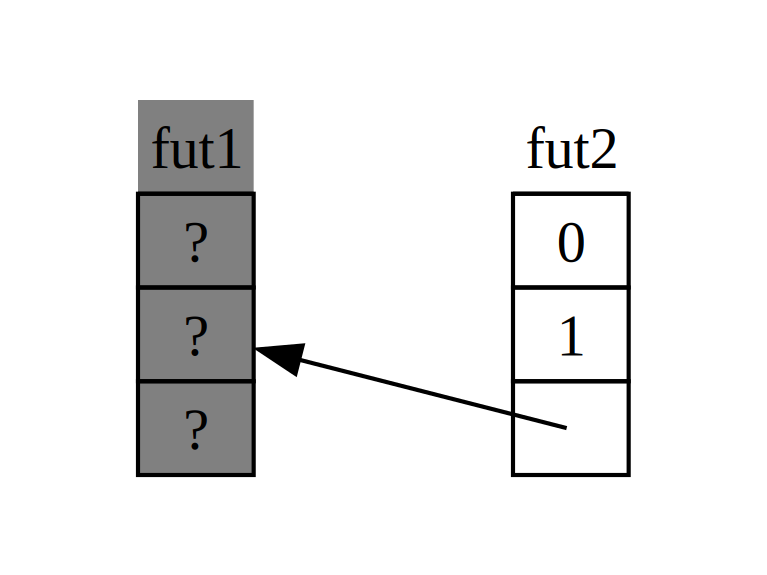
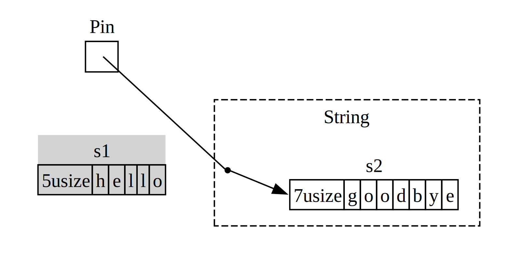

# 近观异步的特质

在这一章中，我们以各种方式使用了 `Future`、`Stream` 及 `StreamExt` 等特质。不过到目前为止，我们都还没有过多探讨他们的工作原理或他们如何相互关联的细节，这对咱们日常的 Rust 开发工作来说通常已经足够。但有时，咱们会遇到需要进一步了解这些特质的细节，以及 `Pin` 类型和 `Unpin` 特质的情况。在这一小节中，我们将适度深入探讨，以在这些场景下有所帮助，而 *真正* 深入的探讨仍留给其他文档。


## `Future` 特质

我们以仔细看看 `Future` 特质的工作原理开始。下面是 Rust 定义他的方式：

```rust
use std::pin::Pin;
use std::task::{Context, Poll};

pub trait Future {
    type Output;

    fn poll(self: Pin<&mut Self>, cx: &mut Context<'_>) -> Poll<Self::Output>;
}
```

这一特质定义包含了一堆新类型，以及一些我们以前从未见过的语法，因此我们来逐一解析该定义。

首先，`Future` 的关联类型 `Output` 表明未来值解析为什么。这类似于 [`Iterator` 特质的关联类型 `Item`](../functional_features/iterators.md#iterator-特质与-next-方法)。其次，`Future` 有着 `poll` 方法，其取一个特殊的 `Pin` 引用作为他的 `slef` 参数，和到一个 `Context` 类型的可变引用，并返回 `Poll<Self::Output>`。稍后我们将详细讨论 `Pin` 与 `Context`。目前，我们来先关注该方法返回的内容，即 `Poll` 类型：

```rust
enum Poll<T> {
    Ready(T),
    Pending,
}
```

这种 `Poll` 类型类似于 `Option`。他有个有值的变种，`Ready(T)`，还有个没有值的变种 `Pending`。不过，`Poll` 所指的内容与 `Option` 截然不同！`Pending` 变种表示未来值仍有工作要做，因此调用者将需要在稍后再次检查。`Ready` 变种表示未来值已完成其工作，且 `T` 值可用。

> **注意**：很少需要直接调用 `poll`，但当咱们确实需要时，就要记住，对于大多数未来值，调用者都不应在未来值返回 `Ready` 后，再次调用 `poll`。许多未来值在成为就绪之后若再次被轮询，都将终止运行。再次轮询安全的未来值会在其文档中明确说明。这与 `Iterator::next` 的行为类似。


当咱们看到使用 `await` 的代码时，Rust 会在背后将其编译为调用 `poll` 的代码。当咱们回顾 [清单 17-4](./futures.md#listing_17-4) 时，其中我们在单个 URL 解析后打印出出页面标题，Rust 将其编译成类似（尽管不完全是）下面这样的代码：


```rust
match page_title(url).poll() {
    Ready(page_title) => match page_title {
        Some(title) => println!("{url} 的标题是 {title}"),
        None => println!("{url} 没有标题"),
    }
    Pending => {
        // 但这里会是什么呢？
    }
}
```

当未来值仍处于 `Pending` 时，我们该怎么办？我们需要某种方式来一次又一次地尝试，直到未来值最终就绪。换句话说，我们需要一个循环：

```rust
let mut page_title_fut = page_title(url);

loop {
    match page_title_fut.poll() {
        Ready(value) => match page_title {
            Some(title) => println!("{url} 的标题是 {title}"),
            None => println!("{url} 没有标题"),
        }
        Pending => {
            // 继续
        }
    }
}
```

不过，若 Rust 将其编译成这完全相同的代码，那么每个 `await` 都将阻塞 -- 这与我们的初衷背道而驰！相反，Rust 确保循环可以移交控制权给某个组件，该组件可以暂停这个未来值的处理以处理其他未来值，然后稍后再次检查这个未来值。正如我们所见，这个组件就是异步运行时，而这种调度和协调工作正是其主要职责之一。

在 [使用消息传递在两个任务之间发送](./concurrency_n_async.md#使用消息传递在两个任务之间发送) 小节中，我们描述了对 `rx.recv` 的等待。`recv` 调用返回一个未来值，而等待该未来值会轮询他。我们注意到，运行时会暂停该未来值，直到其以 `Some(message)` 或信道关闭时的 `None` 就绪。随着我们对 `Future` 特质，特别是 `Future::poll` 方法的深入理解，我们可以明白其工作原理。当轮询返回 `Poll::Pending` 时，运行时知道未来值尚未就绪。相反，当 `poll` 返回 `Poll::Ready(Some(message))` 或 `Poll::Ready(None)` 时，运行时知道该未来值 *为* 准备就绪并将其推进。

运行时如何实现这一的具体细节超出了本书的范围，但关键是了解未来值的基本机制：运行时 *轮询* 他所负责的每个未来值，在未来值尚未就绪时将其重新置于休眠状态。


## `Pin` 与 `Unpin` 特质

回到 [清单 17-13](./concurrency_n_async.md#listing_17-13)，我们使用了 `trpl::join!` 宏来等待三个未来值。然而，通常情况下都有着包含直到运行时才已知数量未来值的诸如矢量值的某种集合。我们来修改清单 17-13 为下面清单 17-23 中的代码，放置三个未来值到一个矢量中，并转而调用 `trpl::join_all` 函数，其尚不会编译。

<a name="listing_17-23"></a>
文件名：`src/main.rs`

```rust
        let tx_fut = async move {
            // -- 跳过代码 --
        };

        let futures: Vec<Box<dyn Future<Output = ()>>> =
            vec![Box::new(tx1_fut), Box::new(rx_fut), Box::new(tx_fut)];

        trpl::join_all(futures).await;
```

**清单 17-23**：等待集合中的未来值

我们放置每个未来值于 `Box` 内，使他们成为 *特质对象*，就像我们在第 12 章中 [返回 `run` 中的错误](../io_project/refactoring.md#返回-run-中的错误) 小节中所做的那样。（我们将在第 18 章中详细介绍特质对象。）使用特质对象让我们可以将这些类型生成的每个匿名未来值视为同一类型，因为他们都实现了 `Future` 特质。

这可能会令人惊讶。毕竟，没有一个异步代码块返回任何内容，因此每个都会生成一个 `Future<Output = ()>`。但请记住，`Future` 属于特质，编译器会为每个异步代码块创建一个唯一的枚举，即使他们有着相同的输出类型。正如咱们不能放置两个不同的手写结构体于 `Vec` 中一样，咱们也不能混合编译器生成的枚举。

然后我们传递这个未来值的集合给 `trpl::join_all` 函数并等待结果。然而，这段代码不会编译；以下是错误信息的相关部分。


```console
error[E0277]: `dyn Future<Output = ()>` cannot be unpinned
  --> src/main.rs:45:9
   |
45 |         trpl::join_all(futures).await;
   |         ^^^^^^^^^^^^^^^^^^^^^^^ the trait `Unpin` is not implemented for `dyn Future<Output = ()>`
   |
   = note: consider using the `pin!` macro
           consider using `Box::pin` if you need to access the pinned value outside of the current scope
   = note: required for `Box<dyn Future<Output = ()>>` to implement `Future`
note: required by a bound in `futures_util::future::join_all::JoinAll`
  --> /home/hector/.cargo/registry/src/mirrors.ustc.edu.cn-5857e57f01837ef8/futures-util-0.3.32/src/future/join_all.rs:29:8
   |
27 | pub struct JoinAll<F>
   |            ------- required by a bound in this struct
28 | where
29 |     F: Future,
   |        ^^^^^^ required by this bound in `JoinAll`

```

这一错误消息中的注解告诉我们，应使用 `pin!` 宏来 *固定* 值，这意味着放置他们于 `Pin` 类型内，以保证这些值不会在内存中迁移。错误消息指出需要固定，因为 `dyn Future<Output = ()>` 需要实现 `Unpin` 特质，而他目前尚未实现。

`trpl::join_all` 函数返回一个名为 `JoinAll` 的结构体。该结构体对类型 `F` 是泛型的，被约束为实现 `Future` 特质。以 `await` 直接等待未来值，会隐式地固定该未来值。这就是为什么我们不需要在等待未来值的每个地方都使用 `pin!`。

不过，我们在这里并不是直接等待未来值。相反，我们通过传递一个未来值集合给 `join_all` 函数，构造了一个新的未来值 `JoinAll`。`join_all` 的签名要求集合中项目的类型都实现 `Future` 特质，而仅当他所封装的 `T` 是个实现 `Unpin` 特质的未来值时，`Box<T>` 才实现 `Future` 特质。

这确实有很多内容需要消化！为了真正理解这一点，我们来进一步深入了解 `Future` 特性的实际工作原理，特别是在固定方面。请再次查看 `Future` 特质的定义：


```rust
use std::pin::Pin;
use std::task::{Context, Poll};

pub trait Future {
    type Output;

    // 必需方法
    fn poll(self: Pin<&mut Self>, cx: &mut Context<'_>) -> Poll<Self::Output>;
}
```

其中 `cx` 参数及其 `Context` 类型，是运行时在保持惰性计算的同时，实际判断何时检查给定 `Future` 的关键。同样，其具体工作原理超出了本章的讨论范围，咱们通常只有在编写定制 `Future` 实现时，才需要考虑这一点。我们转而将重点关注 `self` 的类型，因为这是我们第一次看到其中 `self` 有着类型注解的方法。 `self` 的类型注解，与其他函数参数的类型注解原理相同，但有两个关键区别：

- 他告诉 Rust，对于要调用的方法 `self` 必须是什么类型；
+ 他不能只是任意类型。他仅限于
    - 方法实现所基于的类型、
    - 到该类型的引用或灵巧指针，
    - 或者封装了到该类型的引用的 `Pin`。


我们将在 [第 18 章](../Ch17_Object_Oriented_Programming_Features_of_Rust.md) 中看到有关这一语法的更多内容。目前只需知道，当我们打算轮询某个未来值，来检查他处于 `Pending` 还是 `Ready(Output)` 状态时，就需要一个由 `Pin` 封装的指向该类型的可变引用。

`Pin` 是针对 `&`、`&mut`、`Box` 和 `Rc` 等类指针类型的封装器。（从技术上讲，`Pin` 适用于实现 `Deref` 或 `DerefMut` 特质的类型，但这实际上相当于仅适用于引用和灵巧指针。）`Pin` 本身并非指针，也不具备 `Rc` 和 `Arc` 那样带有引用计数的自身行为；他纯粹是编译器用来强制执行指针使用约束的工具。

回顾一下，`await` 是通过调用 `poll` 来实现的，这开始解释了我们之前看到的错误信息，但错误消息提到 `Unpin`，而不是 `Pin`。那么，`Pin` 与 `Unpin` 究竟有何关联？为什么 `Future` 需要 `self` 属于 `Pin` 类型才能调用 `poll`？

还记得这一章前面的内容吗？某个未来值中的一系列等待点，会被编译成一个状态机，而编译器会确保该状态机遵循 Rust 所有关于安全性的正常规则，包括借用和所有权。为了实现这一点，Rust 会分析从一个等待点到下一个等待点，或到异步代码块结束处之间所需的数据。随后，他会在编译后的状态机中创建相应的变体。每个变体都会获得对将用于源代码中该小节的数据的所需权限，无论是通过获取该数据的所有权，还是通过获取对其的可变或不可变引用。

到目前为止一切顺利：当我们在给定异步代码块中的所有权或引用方面有任何错误之处，借用检查器都将告诉我们。但当我们迁移与该代码块对应的未来值时 —— 比如迁移他到 `Vec` 中以传递给 `join_all` —— 情况就会变得棘手。

当我们迁移未来值时 —— 无论是压入其到数据结构中，作为用作与 `join_all` 一起使用的迭代器，还是从函数中返回他 —— 这实际上意味着迁移 Rust 为我们创建的状态机。而且与 Rust 中的大多数其他类型不同，Rust 为异步代码块创建的未来值，最终会成为在某个变体的字段中对自身的引用，如下图 17-4 中的简化示意图所示。

<a name="f_17-4"></a>


**图 17-4**：自引用数据类型


但在默认情况下，任何有着对自身的引用的对象，在迁移时都是不安全的，因为引用总是指向其引用对象的实际内存地址（见图 17-5）。当咱们迁移数据结构本身时，这些内部引用将保留指向旧的位置。然而，该内存位置现在是无效的。一方面，当咱们修改数据结构时，其值将不会得以更新。更重要的是，计算机现在可以自由地将该内存用于其他目的！咱们最终会读取到完全无关的数据。

<a name="f_17-5"></a>


**图 17-5**：迁移自引用数据类型的不安全结果

理论上，Rust 编译器可以尝试在对象被迁移时更新指向该对象的所有引用，但这会增加大量性能开销，尤其是当整个引用网络需要更新时。当我们转而可以确保相关的数据结构在内存中 *不会被迁移* 时，我们将不必更新任何引用。这正是 Rust 的借用检查器的作用：在安全的代码中，他会阻止咱们迁移带有活动引用引用的项目。

`Pin` 在此基础上给予我们所需的确切保证。当我们通过封装指向该值的指针在 Pin 中，*固定* 某个值时，其便无法再被迁移。因此，当咱们有着 `Pin<Box<SomeType>>` 时，咱们实际上固定了 `SomeType` 值，而 *不是* `Box` 指针。下图 17-6 演示这一过程。

<a name="f_17-6"></a>


**图 17-6**：固定某个 `Box`，其指向某个自引用的未来值类型

实际上，指针 `Box` 仍然可以自由迁移。请记住：我们关心的是确保最终引用的数据保持在原地。当指针迁移时，*但他所指向的数据* 位于原处，如下图 17-7 中所示，则没有潜在的问题。（作为一项独立练习，请查阅该类型以及 `std::pin` 模组的文档，并尝试弄清楚咱们如何以封装 `Box` 的 `Pin` 来实现这点。）关键在于，自引用类型本身无法迁移，因为他仍然被固定着。

<a name="f_17-7"></a>


**图 17-7**：迁移某个 `Box`，其指向某个自引用的未来值类型

然而，大多数类型都可以安全地迁移，即使他们恰好位于 `Pin` 指针之后。我们只需在项目有着内部引用时，才需要考虑固定操作。数字和布尔值等原始值是安全的，因为他们显然没有任何内部引用。咱们在 Rust 中通常使用的绝大多数类型也是如此。例如，咱们可以放心迁移 `Vec`。根据我们迄今所见，当咱们有个 `Pin<Vec<String>>` 时，就必须通过 `Pin` 提供的安全但受限的 API 执行所有操作，即使在没有其他引用时 `Vec<String>` 始终可以安全地迁移。我们需要一种方式来告诉编译器，在这种情况下迁移项目是安全的 —— 而这就是 `Unpin` 发挥作用的地方。

`Unpin` 是个标记特质，类似于我们在第 16 章中看到的 `Send` 和 `Sync` 特质，而因此本身不具备任何功能。标记特质的存在只是为了告知编译器，在特定上下文中使用实现给定特质的类型是安全的。`Unpin` 通知编译器，给定类型 *不* 需要对相关值是否可以安全移动提供任何保证。

就像 `Send` 和 `Sync` 一样，编译器会自动为所有能证明其安全的类型实现 `Unpin`。与 `Send` 和 `Sync` 类似的一种特殊情况是，`Unpin` 并 *未* 针对某种类型实现。其表示法为 `impl !Unpin for SomeType`，其中 `SomeType` 是类型的名称，每当在 `Pin` 中使用指向该类型的指针时，该类型都 *必须* 遵守这些保证才能确保安全。

换句话说，关于 `Pin` 和 `Unpin` 之间的关系，有两点需要记住。首先，`Unpin` 属于 “正常” 情况，而 `!Unpin` 属于特殊情况。其次，只有在咱们使用指向该类型的固定指针（如 `Pin<&mut SomeType>`）时，类型是实现了 `Unpin` 还是 `!Unpin` 才重要。

为了具体说明这一点，请考虑一个 `String`：他有着一个长度以及构成他的 Unicode 字符。我们可以像下图 17-8 中所示那样，封装 `String` 在 `Pin` 中。然而，`String` 会自动实现 `Unpin`，正如 Rust 中大多数其他类型那样。

<a name="f_17-8"></a>


**图 17-8**：固定一个 `String`；虚线表示 `String` 实现了 `Unpin` 特质，而因此未被固定

因此，我们可以执行一些当 `String` 实现了 `!Unpin` 时不合法的操作，比如下图 17-9 中所示，在内存中完全相同的位置以一个字符串替换另一个字符串。这并不违反 `Pin` 的合约，因为 `String` 没有使迁移不安全的内部引用。这正是他实现 `Unpin` 而非 `!Unpin` 的原因。


<a name="f_17-9"></a>


**图 17-9**：在内存中以一个完全不同的 `String` 替换原有的 `String`

现在我们已经掌握了足够的知识，可以理解 [清单 17-23](#listing_17-23) 中 `join_all` 调用所报告的错误了。我们最初尝试迁移异步代码块生成的未来值到 `Vec<Box<dyn Future<Output = ()>>>` 中，但正如我们所见，这些未来值可能有着内部引用，因此他们没有自动实现 `Unpin`。 一旦我们固定他们，我们就可以传递生成的 `Pin` 类型给 `Vec`，并确信未来值中的底层数据不会被迁移。下面清单 17-24 展示了如何通过在三个未来值各自的定义处，调用 `pin!` 宏并调整特质对象类型来修复代码。

<a name="listing_17-24"></a>
```rust
use std::pin::{Pin, pin};

// --跳过代码--

        let tx1_fut = pin!(async move {
            // --跳过代码--
        });

        let rx_fut = pin!(async {
            // --跳过代码--
        });

        let tx_fut = pin!(async move {
            // --跳过代码--
        });

        let futures: Vec<Pin<&mut dyn Future<Output = ()>>> =
            vec![tx1_fut, rx_fut, tx_fut];
```

**清单 17-24**：固定未来值，以便能够迁移他们到矢量中

这个示例现在会编译并运行，并且我们可以在运行时向该矢量值添加或移除未来值，并将他们全部连接起来。

`Pin` 和 `Unpin` 主要对于构建底层库，或者咱们在构建运行时本身时很重要，而非日常的 Rust 代码。但是，当咱们在错误消息中看到这两个特质时，现在咱们将更好地了解，该如何修复代码了！

> **注意**：`Pin` 和 `Unpin` 的这种组合，使得在 Rust 中安全地实现一整类复杂类型成为可能，否则将具挑战性，因为这些复杂类型属于自引用的。如今，需要 `Pin` 的类型最常见于异步 Rust 中，但偶尔咱们也会在其他场景中见到他们。
>
> 关于 `Pin` 和 `Unpin` 的具体工作原理，及其必须遵守的规则，在 `std::pin` 的 API 文档中有详尽的说明，因此若咱们打算了解更多，这是个很好的起点。
>
> 若咱们想更深入地了解其底层工作原理，请参阅 [《Rust 异步编程》](https://rust-lang.github.io/async-book/) 的 [第 2 章](https://rust-lang.github.io/async-book/02_execution/01_chapter.html) 和 [第 4 章](https://rust-lang.github.io/async-book/04_pinning/01_chapter.html)。


## `Stream` 特质

现在咱们对 `Future`、`Pin` 和 `Unpin` 特质有了更深入的理解，我们就可以转移注意力到 `Stream` 特质了。正如你在这一章前面了解到的，流类似于异步的迭代器。然而，与 Iterator 和 Future 不同的是，截至本文撰写之时，标准库中尚未定义 Stream，但 futures 库中提供了一个非常通用的定义，该定义在整个生态系统中被广泛使用。

在探讨 Stream 特质如何将它们融合之前，让我们先回顾一下 Iterator 和 Future 特质的定义。从 Iterator 中，我们获得了序列的概念：其 next 方法返回 Option<Self::Item>。从 Future 中，我们获得了随时间推移而就绪的概念：其 poll 方法返回 Poll<Self::Output>。为了表示随时间推移而就绪的项目序列，我们定义了一个将这些特性结合在一起的 Stream 特质：
