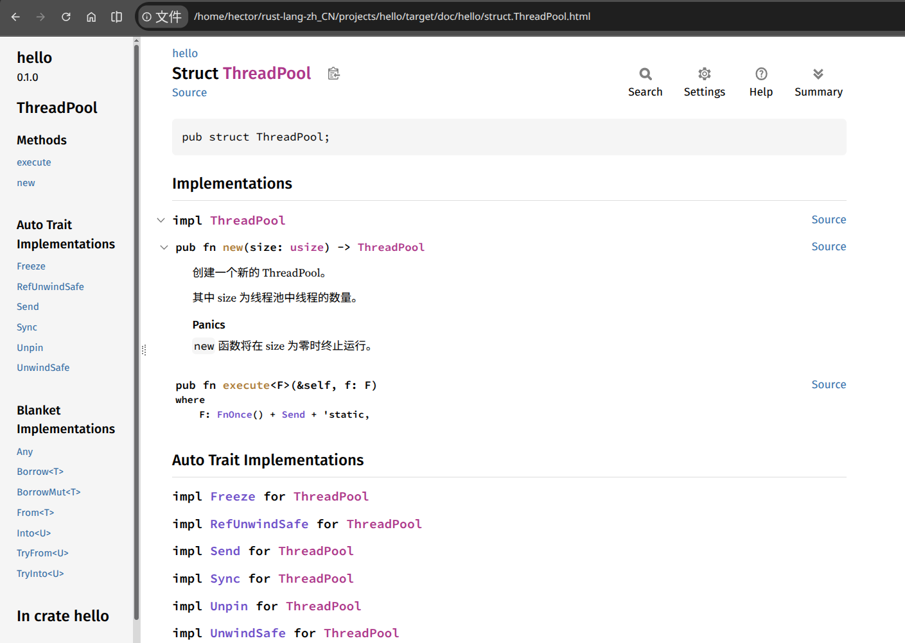

# 从单线程服务器到多线程服务器

目前，服务器将依次处理每个请求，这意味着在第一个连接处理完毕之前，他不会处理第二个连接。当服务器收到越来越多的请求时，这种串行执行将越来越不理想。当服务器收到一个需要很长时间处理的请求时，后续请求就必须等该该请求处理完毕，即使这些新请求可被快速处理。我们需要解决这个问题，但首选我们将看看实际操作中的问题。


## 模拟慢速请求

我们将探讨处理慢速请求会怎样影响向当前服务器发出的其他请求。下面清单 21-10 实现了通过模拟慢速响应来处理对 `/sleep` 的请求，这将导致服务器在响应之前休眠 5 秒钟。

<a name="listing_21-10"></a>
文件名：`projects/hello/src/main.rs`

```rust
use std::{
    fs,
    io::{prelude::*, BufReader},
    net::{TcpListener, TcpStream},
    thread,
    time::Duration,
};
// --跳过代码--

fn handle_connection(mut stream: TcpStream) {
    // --跳过代码--

    let (status_line, filename) = match &request_line[..] {
        "GET / HTTP/1.1" => ( "HTTP/1.1 200 OK", "hello.html"),
        "GET /sleep HTTP/1.1" => {
            thread::sleep(Duration::from_secs(5));
            ("HTTP/1.1 200 0K", "hello.html")
        }
        _ => ("HTTP/1.1 404 NOT FOUND", "404.html"),
    };

    // --跳过代码--
}
```

**清单 21-10**：通过休眠 5 秒来模拟慢速请求

现在我们有三种情况，于是已从 `if` 切换为 `match`。我们需要显式地对 `request_line` 的一个切片匹配，以与字符串字面值模式匹配；`match` 不会像相等比较方式那样，执行自动引用和解引用。

第一个支臂与 [清单 21-9](./single-threaded.md#listing_21-9) 中的 `if` 代码块相同。第二个支臂匹配到 `/sleep` 的请求。收到该请求后，服务器将在渲染成功 HTML 页面之前休眠 5 秒。第三个支臂与清单 21-9 中的 `else` 代码块相同。

咱们可以看到我们的服务器是多么的原始：真正的库将以更简洁的方式处理多个请求的识别！

请使用 `cargo run` 启动服务器。然后，打开两个浏览器窗口：一个用于 `http://127.0.0.1/7878`，另一个用于 `http://127.0.0.1:7878/sleep`。当咱们像之前那样多次输入 `/` 的 URI，咱们将发现他响应很快。但当咱们先输入 `/sleep`，然后加载 `/` 时，就会发现 `/` 会等待 `sleep` 休眠 5 秒后才加载。

我们可使用多种技术，来避免请求在慢速请求后面积压，包括像在第 17 中那样使用异步；我们将实现的是线程池。


## 通过线程池提升吞吐量

所谓 *线程池，thread pool*，是一组已创建的线程，他们出于就绪状态并等待处理任务。当程序接收到新任务时，他会将池中的线程之一分配给该任务，进而该线程将处理该任务。在第一个线程处理期间，池中剩余的线程可用于处理任何新到任务。当第一个线程处理完其任务后，他会被返回到空闲线程池，准备处理新任务。线程池允许咱们同时处理连接，从而提高服务器的吞吐量。

我们将把线程池中的线程数量限制为少量，以保护我们免受拒绝服务，DoS，攻击；若我们让程序为每个传入的请求都创建一个新线程，那么当某人向我们的服务器发出 1000 万次请求时，就会耗尽服务器的所有资源，导致请求处理彻底瘫痪，从而造成严重破坏。

因此，与其生成无限数量的线程，我们不如让固定数量的线程在池中等待。传入的请求将发送到池中进行处理。线程池将维护一个传入请求的队列。池中的每个线程都将弹出池中的一个请求，处理该请求，然后向队列请求另一个请求。在这种设计下，我们最多可以同时处理 `N` 个请求，其中 `N` 是线程数。当每个线程都在处理耗时较长的请求时，后续请求仍然会在队列中积压，但我们增加了在到达该临界点之前，可以处理的耗时请求的数量。

这种技术只是提高 web 服务器吞吐量的众多方法之一。咱们可能探索的其他选项，比如

- [分叉汇合模型，fork/join model](https://en.wikipedia.org/wiki/Fork%E2%80%93join_model)、
- [单线程异步 I/O 模型，single-threaded async I/O model](https://medium.com/@sairaju.atukuri123/how-does-async-handle-api-requests-in-a-single-thread-1eeff8480dab)，
- 以及 [多线程异步 I/O 模型，multi-threaded async I/O model](https://en.wikipedia.org/wiki/Asynchronous_I/O) 等等。

若咱们对这一主题感兴趣，可以进一步了解其他解决方案并尝试实现他们；对于 Rust 这样的底层编程语言，所有这些选项都是可行的。

在开始实现线程池之前，我们来先讨论以下使用线程池子应呈现何种形态。当咱们尝试设计代码时，首先编写客户端接口有助于引导咱们的设计思路。应按照咱们希望调用代码的组织方式编写代码的 API；然后，在这种组织方式下实现功能，而不是先实现功能再设计公开 API。

与我们在第 12 章中的项目中使用的测试驱动开发的方式类似，我们在这里将使用编译器驱动开发，compiler-driven development。我们将编写所需函数的代码，然后我们将查看编译器中的报错，以确定下一步应如何修改代码使其正常运行。但在开始之前，我们将先探讨一种我们不会使用的技术作为起点。


### 为每个请求生成一个线程

首先，我们来探讨一下，当为每个连接都创建一个新线程时，我们的代码会是什么样子。正如早先提到的，由于可能生成无限数量的线程，这并非我们的最终方案，但他是构建一个可运行的多线程服务器的起点。然后，我们将添加线程池作为改进，从而对比这两种方案会更容易。

下面清单 21-11 展示了对 `main` 构造的更改，以便在 `for` 循环内为处理每个流而生成新线程。

<a name="listing_21-11"></a>
文件名：`projects/hello/src/main.rs`

```rust
fn main() {
    let listener = TcpListener::bind("127.0.0.1:7878").unwrap();

    for stream in listener.incoming() {
        let stream = stream.unwrap();

        thread::spawn(|| {
            handle_connection(stream);
        });
    }
}
```

**清单 21-11**：为每个流都生成一个新线程

正如咱们在第 16 章中所学到的，`thread::spawn` 将创建一个新线程，然后在新线程中运行闭包中的代码。当咱们运行这段代码，并在浏览器中加载 `/sleep`，然后在另外两个浏览器 Tab 页中加载 `/`，咱们确实会发现到 `/` 的请求不必等待 `/sleep` 完成。然而，正如我们提到的，这最终将使系统不堪重负，因为咱们会无限制地创建新线程。

咱们可能还记得第 17 章中的内容，这正是异步和等待真正大显身手的情形！在我们构建线程池时请记住这一点，并思考在异步下会有何不同或相同点。


### 创建有限数量的线程

我们希望线程池以类似、熟悉的方式工作，这样在使用我们 API 的代码中，从单线程切换到线程池是，就无需进行大量更改。下面清单 21-12 展示了我们打算用来替换 `thread::spawn` 的 `ThreadPool` 结构体的假设接口。

<a name="listing_21-12"></a>
文件名：`src/main.rs`

```rust
fn main() {
    let listener = TcpListener::bind("127.0.0.1:7878").unwrap();
    let pool = ThreadPool::new(4);

    for stream in listener.incoming() {
        let stream = stream.unwrap();

        pool.execute(|| {
            handle_connection(stream);
        });
    }
}
```

**清单 21-12**：我们的理想 `ThreadPool` 接口

我们使用 `ThreadPool::new` 创建一个线程池，带有可配置的线程数量，在这一情形下为四个。然后，在 `for` 循环中，`pool.execute` 有着与 `thread::spawn` 类似的接口，即他取一个闭包，线程池应针对每个流运行该闭包。我们需要实现 `pool.execute` 方法，使其取闭包并将该闭包交由线程池中的某个线程执行。这段代码还不会编译，但我们将尝试编译，以便编译器可以指导我们如何修复他。


### 使用编译器驱动开发构建 `ThreadPool`

请对 `src/main.rs` 进行清单 21-12 中的修改，然后我们来运用 `cargo check` 中的编译器报错驱动我们的开发。下面是我们得到的第一个报错：

```console
$ cargo check
    Checking hello v0.1.0 (/home/hector/rust-lang-zh_CN/projects/hello)
error[E0433]: failed to resolve: use of undeclared type `ThreadPool`
  --> src/main.rs:11:16
   |
11 |     let pool = ThreadPool::new(4);
   |                ^^^^^^^^^^ use of undeclared type `ThreadPool`

For more information about this error, try `rustc --explain E0433`.
error: could not compile `hello` (bin "hello") due to 1 previous error
```

太好了！这个错误告诉我们，我们需要一个 `ThreadPool` 类型或模组，所以我们现在就构建一个。我们的 `ThreadPool` 实现将独立于我们的 web 服务器正在执行的工作类别。因此，我们来将 `hello` 代码箱，从二进制代码箱切换为库代码箱，来保存我们的 `ThreadPool` 实现。更改为库代码箱后，我们还可以针对我们打算使用线程池来完成的任何工作，都使用这个独立的线程池，而不仅仅用于服务 web 请求。

请创建一个 `src/lib.rs` 文件，包含以下代码，这是目前我们可以实现的 `ThreadPool` 结构体的最简单定义：

文件名：`projects/hello/src/lib.rs`

```rust
pub struct ThreadPool;
```

然后，编辑 `main.rs`，通过添加以下代码到 `src/main.rs` 的顶部，从库代码箱带入 `ThreadPool` 作用域：

文件名：`projects/hello/src/main.rs`

```rust
use hello::ThreadPool;
```

这段代码仍然无法运行，但我们来再检查一遍，以得到下一个我们需要解决的报错：

```console
$ cargo check
    Checking hello v0.1.0 (/home/hector/rust-lang-zh_CN/projects/hello)
error[E0599]: no function or associated item named `new` found for struct `ThreadPool` in the current scope
  --> src/main.rs:13:28
   |
13 |     let pool = ThreadPool::new(4);
   |                            ^^^ function or associated item not found in `ThreadPool`

For more information about this error, try `rustc --explain E0599`.
error: could not compile `hello` (bin "hello") due to 1 previous error
```

这个报错表明，接下来我们需要为 `ThreadPool` 创建一个名为 `new` 的关联函数。我们还知道，`new` 需要有个形参，可以接受 `4` 作为实参，并且应该返回一个 `ThreadPool` 实例。我们来实现一个有着这些特征的最简单的 `new` 函数：

文件名：`projects/hello/src/lib.rs`

```rust
pub struct ThreadPool;

impl ThreadPool {
    pub fn new(size: usize) -> ThreadPool {
        ThreadPool
    }
}
```

我们选择 `usize` 作为 `size` 参数的类型，因为我们知道负数的线程数毫无意义。我们还知道，我们将使用 `4` 作为线程集合中元素的个数，这就是 `usize` 类型的用途，正如第 3 章中 [整型](../programming_concepts/data_types.md#整型) 小节中讨论的那样。

我们来再次检查代码：

```console
$ cargo check
    Checking hello v0.1.0 (/home/hector/rust-lang-zh_CN/projects/hello)
error[E0599]: no method named `execute` found for struct `ThreadPool` in the current scope
  --> src/main.rs:18:14
   |
18 |         pool.execute(|| {
   |         -----^^^^^^^ method not found in `ThreadPool`

For more information about this error, try `rustc --explain E0599`.
error: could not compile `hello` (bin "hello") due to 1 previous error
```

现在报错出现，是因为我们在 `ThreadPool` 上没有 `execute` 方法。回顾 [创建有限数量的线程](#创建有限数量的线程) 小节，我们决定线程池应该有个类似于 `thread::spawn` 的接口。此外，我们将实现 `execute` 函数，使其取得给予他的闭包，并将该闭包交给线程池中的空闲线程运行。

我们将定义 `ThreadPool` 上的 `execute` 方法为取一个闭包作为参数。回顾第 13 章中的 [从闭包中迁出捕获值](../functional_features/closures.md#从闭包中迁出捕获值) 小节，我们可以通过三种不同特质取闭包作为参数：`Fn`、`FnMut` 与 `FnOnce`。我们需要决定在这里使用哪种闭包类别。我们知道我们最终将执行一些类似于标准库的 `thread::spawn` 实现的操作，因此我们可以查看 `thread::spawn` 的签名，在参数上有哪些边界。文档向我们展示了以下内容：

```rust
pub fn spawn<F, T>(f: F) -> JoinHandle<T>
    where
        F: FnOnce() -> T,
        F: Send + 'static,
        T: Send + 'static,
```

其中 `F` 类型参数是我们在这里关心的；`T` 类型参数与返回值有关，而我们并不关心这点。我们可以看到，`spawn` 使用 `FnOnce` 作为 `F` 的特质边界。这很可能也是我们想要的，因为我们最终将传递 `execute` 中获得的实参给 `spawn`。由于运行请求的线程将只执行该请求的闭包一次，这与 `FnOnce` 中的 `Once` 一致，因此我们可以进一步确信 `FnOnce` 就是我们要使用的特质。

`F` 类型参数还有着特质边界 `Send` 和生命周期边界 `'static`，这在我们的情形下非常有用：我们需要 `Send` 来从一个线程转移闭包到另一线程，需要 `'static` 是由于我们不知道线程执行需要多长时间。我们来对 `ThreadPool` 创建一个 `execute` 方法，将取有着以下边界的类型 `F` 的泛型参数：

文件名：`src/lib.rs`

```rust
impl ThreadPool {
    // -- 跳过代码 --
    pub fn execute<F>(&self, f: F)
        where
            F: FnOnce() + Send + 'static,
    {
    }
}
```

我们在 `FnOnce` 之后仍然使用 `()`，因为这个 `FnOnce` 表示一个不取参数且返回单元值类型 `()` 的闭包。就像函数定义一样，返回值类型可在签名中省略，但即使我们没有参数，我们仍然需要这对括号。

同样，这是 `execute` 方法的最简单实现：他什么也不做，但我们只是试图让代码编译。我们来再次检查一下：

```console
$ cargo check
    Checking hello v0.1.0 (/home/hector/rust-lang-zh_CN/projects/hello)
    Finished `dev` profile [unoptimized + debuginfo] target(s) in 0.05s
```

他编译了！但请注意，当咱们尝试运行 `cargo run` 并在浏览器中发出请求时，咱们将看到浏览器中看到在本章开头曾看到的那些报错。我们的库实际上还没有调用传递给 `execute` 的闭包！

> **注意**：关于像 Haskell 和 Rust 这样有着严格编译器的语言，咱们或许听说过一种说法，即 “当代码编译时，他就会运行。” 但这种说法并非放之四海而皆准。我们的项目编译了，但他什么也没做！若我们正在构建一个真实且完整的项目，那么现在正是开始编写单元测试的好时机，以验证代码不仅会编译，*还* 有着我们想要的行为。

请思考：若我们即将执行一个未来值而不是闭包，这里会有什么不同？


### 验证 `new` 中的线程数量

我们没有对 `new` 和 `execute` 的参数执行任何操作。我们来以我们希望的行为实现这两个函数的主体。首先，我们来思考一下 `new`。之前我们为 `size` 参数选择了无符号类型，因为线程数为负的线程池没有意义。然而，有着零个线程的线程池也没有意义，但零是完全有效的 `usize`。在返回 `ThreadPool` 实例之前，我们将添加检查 `size` 是否大于零的代码，在返回一个 `ThreadPool` 实例前，添加检查 `size` 大于零的代码，并当程序通过使用 `assert!` 宏收到零时让程序终止运行，如下清单 21-13 中所示。

<a name="listing_21-13"></a>
文件名：`projects/hello/src/lib.rs`

```rust
impl ThreadPool {
    /// 创建一个新的 ThreadPool。
    ///
    /// 其中 size 为线程池中线程的数量。
    ///
    /// # Panics
    ///
    /// `new` 函数将在 size 为零时终止运行。
    pub fn new(size: usize) -> ThreadPool {
        assert! (size > 0);

        ThreadPool
    }

    // --跳过代码--
}
```

**清单 21-13**：实现 `ThreadPool` 为当 `size` 为零时终止运行

我们还通过 [文档注释](../crates-io/publishing.md#制作有用的文档注释) 为我们的 `ThreadPool` 添加了一些文档。请注意，我们遵循了良好的文档实践，添加了一个小节，之处我们的函数可能会终止运行的情况，正如第 14 章中所讨论的那样。请尝试运行 `cargo doc --open` 并点击 `ThreadPool` 结构体，看看为 `new` 生成的文档是什么样的！

> **译注**：此时 `new` 的文档如下。
>
> 

与其像这里这样添加 `assert!` 宏，我们也可以改 `new` 为 `build`，并像在 [清单 12-9](../io_project/refactoring.md#listing_12-9) 中 I/O 项目中的 `Config::build` 那样返回一个 `Result`。但我们已经决定在这种情况下，尝试创建一个没有任何线程的线程池应该是不可恢复的错误。若咱们感兴趣，那就编写一个有着以下签名的名为 `build` 的函数，与 `new` 函数比较：

```rust
pub fn build(size: usize) -> Result<ThreadPool, PoolCreationError> {
```


### 创建空间来存储线程

现在我们有一种方法知道，我们有要存储在池中的有效线程数量，我们可以创建这些线程并在 `ThreadPool` 结构体中存储他们。但我们要怎样 “存储” 线程呢？我们再看看 `thread::spawn` 的签名：

```rust
pub fn spawn<F, T>(f: F) -> JoinHandle<T>
    where
        F: FnOnce() -> T,
        F: Send + 'static,
        T: Send + 'static,
```

`spawn` 函数返回一个 `JoinHandle<T>`，其中 `T` 是闭包返回的类型。我们也来尝试使用 `JoinHandle`，看看会发生什么。在我们的情形下，传递给线程池的闭包将处理连接，并且不返回任何值，因此 `T` 将是单元值类型 `()`。

下面清单 21-14 中的代码虽然将编译，当目前尚未创建任何线程。我们已修改 `ThreadPool` 的定义为包含一个 `thread::JoinHandle<()>` 实例的矢量值，初始化该矢量值的容量为 `size`，设置了一个 `for` 循环，将运行一些代码来创建线程，并返回一个包含这些线程的 `ThreadPool` 实例。

<a name="listing_21-14"></a>
文件名：`projects/hello/src/lib.rs`

```rust
use std::thread;

pub struct ThreadPool {
    threads: Vec<thread::JoinHandle<()>>,
}

impl ThreadPool {
    // --跳过代码--
    pub fn new(size: usize) -> ThreadPool {
        assert! (size > 0);

        let mut threads = Vec::with_capacity(size);

        for _ in 0..size {
            // 创建出一些线程并将其存储在矢量中
        }

        ThreadPool { threads }
    }
    // --跳过代码--
}
```

**清单 21-14**：为 `ThreadPool` 创建一个用于保存线程的矢量值

我们在库代码箱中带入了 `std::thread` 到作用域，因为我们使用 `thread::JoinHandle` 作为 `ThreadPool` 中矢量值项目的类型。

一旦收到有效的大小，我们的 `ThreadPool` 就会创建一个可包含 `size` 个条目的新矢量值。`with_capacity` 函数执行与 `Vec::new` 相同的任务，但有个重要的区别：他会预先分配矢量值中的空间。由于我们知道需要在矢量值中存储 `size` 个元素，因此预先完成这种分配比使用 `Vec::new` 稍微高效一些，后者会在元素插入时调整自身大小。

在咱们再次运行 `cargo check` 时，他应该会成功。


### 发送 `ThreadPool` 中的代码到线程

我们在清单 21-14 中的 `for` 循环中，留下了关于线程创建的注释。在这里，我们将探讨如何实际创建线程。标准库提供了 `thread::spawn` 作为创建线程的方式，而 `thread::spawn` 期望在线程创建后，立即获得该线程应该运行的一些代码。然而，在我们的情形下，我们打算先创建线程，然后让他们 *等待* 我们稍后将发送的代码。标准库的线程实现并未包含这样做的任何方式；我们必须手动实现他。

我们将通过在 `ThreadPool` 与线程之间引入一种新的数据结构来实现这种行为，该数据结构将管理这种新行为。我们称这一数据结构为 *Worker*，这是线程池实现中常用的术语。`Worker` 会选取需要运行的代码，并他的线程中运行这些代码。

设想餐厅厨房里的工作人员：工作人员会等待顾客下但，然后负责接收菜单并完成烹饪。

我们不再在线程池中存储 `JoinHandle<()>` 实例的矢量值，而是存储 `Worker` 结构体的实例。每个 `Worker` 都将存储单个 `JoinHandler<()>` 实例。然后，我们将对 `Worker` 实现一个方法，该方法将取一个要运行的代码闭包，并将闭包发送到已经运行的线程来执行。我们还将给予每个 `Worker` 一个 `id`，以便在日志记录或调试时，能够区分线程池中不同的 `Worker` 实例。

以下是在创建 `ThreadPool` 时将发生的新过程。在以这种方式设置好 `Worker` 后，我们将实现发送闭包到线程的代码：

1. 定义一个 `Worker` 结构体，包含一个 `id` 和一个 `JoinHandler<()>`；
2. 修改 `ThreadPool` 为包含一个 `Worker` 实例的矢量值；
3. 定义一个 `Worker::new` 函数，取一个 `id` 编号并一个 `Worker` 实例，包含该 `id` 和一个以空闭包生成的线程；
4. 在 `ThreadPool::new` 中，使用 `for` 循环计数器生成一个 `id`，使用该 `id` 创建一个新的 `Worker`，并存储该 `Worker` 于矢量值中。


若咱们愿意接受挑战，不妨在查看清单 21-15 中的代码之前，先尝试自己实现这些修改。

准备好了吗？下面是清单 21-15，有着一种进行上述修改的方式。

<a name="listing_21-15"></a>
文件名：`projects/hello/src/lib.rs`

```rust
use std::thread;

pub struct ThreadPool {
    workers: Vec<Worker>,
}

impl ThreadPool {
    // --跳过代码--
    pub fn new(size: usize) -> ThreadPool {
        assert! (size > 0);

        let mut threads = Vec::with_capacity(size);

        for _ in 0..size {
            workers.push(Worker::new(id));
        }

        ThreadPool { workers }
    }
    // --跳过代码--
}

struct Worker {
    id: usize,
    thread: thread::JoinHandle<()>,
}

impl Worker {
    fn new(id: usize) -> Worker {
        let thread = thread::spawn(|| {});

        Worker { id, thread }
    }
}
```

**清单 21-15**：修改 `ThreadPool` 为包含 `Worker` 实例，而非直接包含线程

我们将 `ThreadPool` 中的字段名字从 `threads` 修改为了 `workers`，因为他现在包含的是 `Worker` 实例，而非 `JoinHandle<()>` 实例。我们使用 `for` 循环中的计数器作为 `Worker::new` 的参数，并存储每个新的 `Worker` 在名为 `workers` 的矢量值中。

外部代码（如 `projects/hello/src/main.rs` 中的服务器）不需要知道有关 `ThreadPool` 中使用 `Worker` 结构体的实现细节，因此我们构造 `Worker` 结构体及其 `new` 函数为私有。`Worker::new` 函数使用我们给予他的 `id`，并存储一个由使用空闭包生成新线程创建的 `JoinHandler<()>` 实例。


> **注意**：当操作系统因没有足够系统资源，而无法创建线程时，`thread::spawn` 将终止运行。这会导致整个服务器终止运行，即使部分线程的创建可能成功。为了简化起见，这种实现行为是可以接受的，但在生产环境的线程池实现中，咱们可能更希望使用 [`std::thread::Builder`](https://doc.rust-lang.org/std/thread/struct.Builder.html)，及其返回 `Result` 的 [`spawn`](https://doc.rust-lang.org/std/thread/struct.Builder.html#method.spawn) 方法。

这段代码将编译，并将存储我们作为参数指定给 `ThreadPool::new` 数量的 `Worker` 实例。但我们 *仍然* 没有处理我们在 `execute` 中得到的闭包。接下来，我们来看看怎样做到这点。


### 通过信道发送请求到线程

接下来我们将解决的问题是，给予到 `thread::spawn` 的闭包不执行任何操作。目前，我们在 `execute` 方法中得到了打算执行的闭包。但在创建 `ThreadPool` 期间创建每个 `Worker` 时，我们需要给予 `thread::spawn` 一个要运行的闭包。

我们希望刚刚创建的 `Worker` 结构体，从包含于 `ThreadPool` 中的一个队列中获取要运行的代码，并发送该代码到其线程以运行。

我们在第 16 章中学过的 [信道](../concurrency/message_passing.md) -- 一种用于两个线程之间通信的简单方式 -- 非常适合这一用例。我们将使用信道作为作业队列，而 `execute` 将发送 `ThreadPool` 中的作业到`Worker` 实例，`Worker` 实例再发送作业到他的线程。该方案如下：

1. `ThreadPool` 将创建一个信道并保留发送器；
2. 每个 `Worker` 都将保留接收器；
3. 我们将创建一个新的 `Job` 结构体，他将包含我们打算通过通道发送的闭包；
4. `execute` 方法将通过发送器发送他希望执行的作业；
5. 在其线程中，`Worker` 实例将对其接收器循环，并执行收到的所有任务的闭包。

首先，我们在 `ThreadPool::new` 中创建一个信道，并将发送器保存在 `ThreadPool` 实例中，如下清单 21-16 中所示。`Job` 结构体现在没有包含任何内容，但将是保存我们通过信道发送的项目的类型。

<a name="listing_21-16"></a>
文件名：`projects/hello/src/lib.rs`

```rust
use std::{sync::mpsc, thread};

pub struct ThreadPool {
    workers: Vec<Worker>,
    sender: mpsc::Sender<Job>,
}

struct Job;

impl ThreadPool {
    // --跳过代码--
    pub fn new(size: usize) -> ThreadPool {
        assert! (size > 0);

        let (sender, receiver) = mpsc::channel();

        let mut workers = Vec::with_capacity(size);

        for id in 0..size {
            workers.push(Worker::new(id));
        }

        ThreadPool { workers, sender }
    }

    // --跳过代码--
}
```

**清单 21-16**：修改 `ThreadPool` 为存储传输 `Job` 实例的信道的发送器

在 `ThreadPool::new` 中，我们创建新通道，并让线程池包含发送器。这段代码将成功编译。

我们来尝试在线程池创建信道时，传递信道的接收器到每个 `worker` 中。我们知道，我们希望在 `workers` 实例生成的线程中使用接收器，因此我们将在闭包中引用 `receiver` 参数。下面清单 21-17 中的代码还不能完全编译。

<a name="listing_21-17"></a>
文件名：`projects/hello/src/lib.rs`

```rust
impl ThreadPool {
    // --跳过代码--
    pub fn new(size: usize) -> ThreadPool {
        assert! (size > 0);

        let (sender, receiver) = mpsc::channel();

        let mut workers = Vec::with_capacity(size);

        for id in 0..size {
            workers.push(Worker::new(id, receiver));
        }

        ThreadPool { workers, sender }
    }

    // --跳过代码--
}

// --跳过代码--

impl Worker {
    fn new(id: usize, receiver: mpsc::Receiver<Job>) -> Worker {
        let thread = thread::spawn(|| {
            receiver;
        });

        Worker { id, thread }
    }
}
```

**清单 21-17**：传递 `receiver` 给每个 `Worker`

我们进行了一些小而直接的修改：我们传递接收器到 `Worker::new` 中，然后在闭包内使用他。

当我们尝试检查这段代码时，会得到下面这样的报错：

```console
$ cargo check
    Checking hello v0.1.0 (/home/hector/rust-lang-zh_CN/projects/hello)
error[E0382]: use of moved value: `receiver`
  --> src/lib.rs:26:42
   |
21 |         let (sender, receiver) = mpsc::channel();
   |                      -------- move occurs because `receiver` has type `std::sync::mpsc::Receiver<Job>`, which does not implement the `Copy` trait
...
25 |         for id in 0..size {
   |         ----------------- inside of this loop
26 |             workers.push(Worker::new(id, receiver));
   |                                          ^^^^^^^^ value moved here, in previous iteration of loop
   |
note: consider changing this parameter type in method `new` to borrow instead if owning the value isn't necessary
  --> src/lib.rs:45:33
   |
45 |     fn new(id: usize, receiver: mpsc::Receiver<Job>) -> Worker {
   |        --- in this method       ^^^^^^^^^^^^^^^^^^^ this parameter takes ownership of the value
help: consider moving the expression out of the loop so it is only moved once
   |
25 ~         let mut value = Worker::new(id, receiver);
26 ~         for id in 0..size {
27 ~             workers.push(value);
   |

For more information about this error, try `rustc --explain E0382`.
error: could not compile `hello` (lib) due to 1 previous error
```

这段代码试图传递 `receiver` 给多个 `Worker` 实例。这行不通，正如咱们回顾第 16 章：Rust 提供的信道实现，属于多 *生产者*、单 *消费者*。这意味着我们不能仅仅克隆信道的消费端来修复这段代码。我们也不希望多次发送一条消息到多个消费者；我们想要带有多个 `Worker`  实例的消息列表，以便每条消息都会被处理一次。

此外，从信道队列中取出作业涉及修改 `receiver`，因此线程需要一种安全的方式来共用和修改 `receiver`；否则，我们可能会遇到竞争条件（如第 16 章中所述）。

回顾第 16 章中讨论的线程安全的灵巧指针：为了在多个线程之间共用所有权并允许实现线程修改值，我们需要使用 `Arc<Mutex<T>>`。`Arc` 类型将允许多个 `Worker` 实例都拥有 `receiver`，而 `Mutex` 将确保一次只有一个 `worker` 获取一项接收器中的作业。下面清单 21-18 展示了我们需要进行的修改。

<a name="listing_21-18"></a>
文件名：`projects/hello/src/lib.rs`

```rust
use std::{
    sync::{mpsc, Arc, Mutex},
    thread,
};
// --跳过代码--

impl ThreadPool {
    // --跳过代码--
    pub fn new(size: usize) -> ThreadPool {
        assert! (size > 0);

        let (sender, receiver) = mpsc::channel();

        let receiver = Arc::new(Mutex::new(receiver));

        let mut workers = Vec::with_capacity(size);

        for id in 0..size {
            workers.push(Worker::new(id, Arc::clone(&receiver)));
        }

        ThreadPool { workers, sender }
    }

    // --跳过代码--
}

// --跳过代码--

impl Worker {
    fn new(id: usize, receiver: Arc<Mutex<mpsc::Receiver<Job>>>) -> Worker {
        // --跳过代码--
    }
}
```

**清单 21-18**：使用 `Arc` 和 `Mutex` 在 `Worker` 实例间共用接收器

在 `ThreadPool::new` 中，我们放置接收器于 `Arc` 和 `Mutex` 中。对于每个新的 `Worker`，我们克隆 `Arc` 以增加引用计数，以便 `Worker` 实例可以共用接收器的所有权。

通过这些修改，代码就会编译了！我们快成功了！


### 实现 `execute` 方法

最后，我们来对 `ThreadPool` 实现 `execute` 方法。我们还将把 `Job` 从结构体修改为特质对象的类型别名，包含 `execute` 接收的闭包类型。正如第 20 章中 [类型同义词和类型别名](../advanced_features/adv_types.md#类型同义词和类型别名) 小节中讨论的，类型别名允许我们使长类型变短以方便使用。请看下面清单 21-19.

<a name="listing_21-19"></a>
文件名：`projects/hello/src/lib.rs`

```rust
// --跳过代码--

type Job = Box<dyn FnOnce() + Send + 'static>;

impl ThreadPool {
    // --跳过代码--

    pub fn execute<F>(&self, f: F)
        where
            F: FnOnce() + Send + 'static,
    {
        let job = Box::new(f);

        self.sender.send(job).unwrap();
    }
}

// --跳过代码--
```

**清单 21-19**：为包含每个闭包的 `Box` 创建 `Job` 类型的别名，然后发送作业到信道

使用从 `execute` 中得到的闭包创建一个新的 `Job` 实例后，我们就发送该作业到信道的发送端。对于发送失败的情形，我们对 `send` 调用 `unwrap` 方法。这种情况可能会发生，比如当我们停止所有线程的执行时，意味着已停止接收新的消息。目前，我们无法停止线程的执行：只要线程池存在，我们的线程就会继续执行。我们使用 `unwrap` 的原因是，我们知道这种失败情况不会发生，但编译器并不知道这点。

但我们还没有完全搞定！在 `Worker` 中，传递给 `thread::spawn` 的闭包仍然只 *引用* 了信道的接收端。相反，我们需要闭包一直循环，不断向信道的接收端请求作业，并获取作业时运行该项作业。我们来对 `Worker::new` 进行下面清单 21-20 中所示的修改。

<a name="listing_21-20"></a>
文件名：`projects/hello/src/lib.rs`

```rust
// --跳过代码--

impl Worker {
    fn new(id: usize, receiver: Arc<Mutex<mpsc::Receiver<Job>>>) -> Worker {
        let thread = thread::spawn(move || {
            loop {
                let job = receiver.lock().unwrap().recv().unwrap();

                println! ("Worker {id} 获得一项作业；执行中。");

                job();
            }
        });

        Worker { id, thread }
    }
}
```

**清单 21-20**：在 `Worker` 实例的线程中接收并执行作业

在这里，我们首选对 `receiver` 调用 `lock` 来获取互斥量，然后调用 `unwrap` 来对任何错误终止运行。当互斥量处于 *中毒* 状态时，则获取锁可能失败，这种情况会在某个其他线于持有锁期间终止运行，而非释放锁时发生。在这种情况下，调用 `unrap` 来让这个线程终止运行，便是要采取的正确操作。咱们可以修改这个 `unwrap` 为带有对咱们有意义的报错信息的 `expect`。

当我们获得了对互斥量的锁时，我们就调用 `recv` 来接收信道中的一个 `Job`。最后一个 `unwrap` 也会消除这里的任何错误，这些错误可能会在持有发送器的线程已关闭时发生，这与 `send` 方法会在接收器关闭时返回 `Err` 的方式类似。

到 `recv` 的调用会阻塞，因此当还没有作业时，当前线程将等待，直到有作业可用。`Mutex<T>` 确保一次只有一个 `Worker` 线程是尝试请求作业。

我们的线程池现在就处于运行状态！运行 `cargo run` 并发出一些请求：


```console
$ cargo run
   Compiling hello v0.1.0 (/home/hector/rust-lang-zh_CN/projects/hello)
    Finished `dev` profile [unoptimized + debuginfo] target(s) in 0.36s
     Running `target/debug/hello`
Worker 0 获得一项作业；执行中。
Worker 1 获得一项作业；执行中。
Worker 2 获得一项作业；执行中。
Worker 3 获得一项作业；执行中。
Worker 0 获得一项作业；执行中。

```

成功了！我们现在有了个能够异步执行连接的线程池。创建的线程永远不会超过四个，因此当服务器收到大量请求时，系统也不会过载。当我们发出到 `/sleep` 的请求时，服务器将能够通过让另一个线程运行其他请求而服务这些请求。

> **注意**：当咱们同时在多个浏览器窗口中打开 `/sleep` 时，他们可能会以五秒的间隔一次加载。出于缓存原因，某些 web 浏览器将顺序执行同一请求的多个实例。这一限制并非由我们的服务器引起。

现在是停下来思考一下的好时机，若我们针对要完成的工作，使用未来值而不是闭包，那么清单 21-18、21-19 和 21-20 中的代码会有什么不同。哪些类型会发生变化？方法签名会有什么不同，如果有的话？代码的哪些部分会保持不变？

在了解了第 17 章和第 19 章中的 `while let` 循环之后，咱们可能想知道，为什么我们没有编写如同清单 21-21 中所示的 `Worker` 线程代码。

<a name="listing_21-20"></a>
文件名：`projects/hello/src/lib.rs`

```rust
impl Worker {
    fn new(id: usize, receiver: Arc<Mutex<mpsc::Receiver<Job>>>) -> Worker {
        let thread = thread::spawn(move || {
            while let Ok(job) = receiver.lock().unwrap().recv() {
                println! ("Worker {id} 获得一项作业；执行中。");

                job();
            }
        });

        Worker { id, thread }
    }
}
```

**清单 21-21**：使用 `while let` 的 `Worker::new` 替代实现

这段代码可以编译并运行，但不会产生所需的线程行为：慢速请求仍将导致其他请求等待处理。原因有些微妙：`Mutex` 结构体没有公开的 `unlock` 方法，因为锁的所有权基于 `lock` 方法返回的 `LockResult<MutexGuard<T>>` 内 `MutexGuard<T>` 的生命周期。在编译时，借用检查器就会强制执行这样的规则：除非我们持有锁，否则无法访问由 `Mutex` 保护的资源。然而，当我们没有注意到 `MutexGuard<T>` 的生命周期时，这种实现也会导致锁被持有的时间超过预期。

清单 21-20 中使用 `let job = receiver.lock().unwrap().recv().unwrap();` 的代码之所以有效，是因为在 `let` 下，等号右侧表达式中使用的任何临时值都会在 `let` 语句结束时被立即弃用。然而，` while let`（以及 `if let` 和 `match`）则不会在相关代码块结束前弃用临时值。 在清单 21-21 中，锁在调用 `job()` 期间一直被持有状态，这意味着其他 `Worker` 实例无法接收作业。


