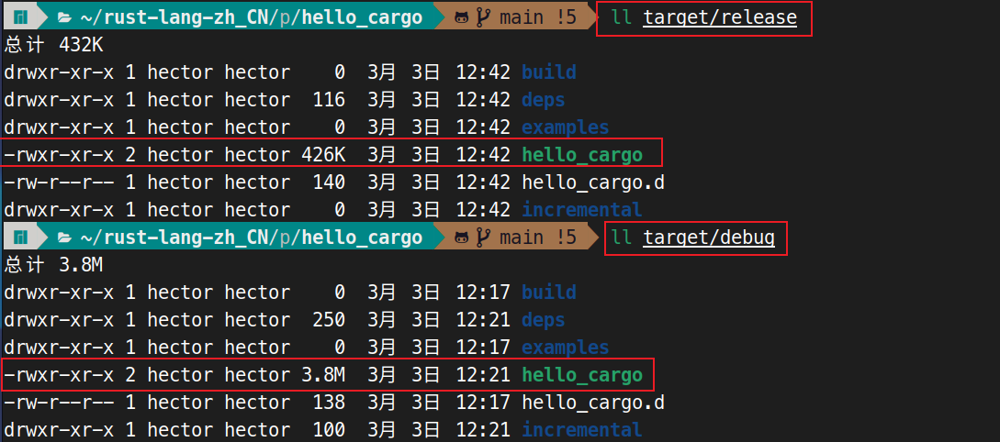

# 你好，Cargo！

Cargo 是 Rust 的构建系统与包管理器。大多数 Rustaceans，都会使用这个工具管理他们的 Rust 项目，因为 Cargo 会为咱们处理很多任务，例如构建咱们的代码、下载咱们代码所依赖的库并构建这些库。(我们把咱们代码所需的库，称为 *依赖项, dependencies*）。

对于那些最简单的 Rust 程序，就像我们迄今为止编写的那个程序一样，并无任何依赖项。当咱们使用 Cargo 构建那个 "Hello, world!" 项目时，他就只会用到 Cargo 中，处理构建咱们代码的部分。而当咱们编写更复杂的 Rust 程序时，咱们将添加一些依赖项，这时咱们如果使用 Cargo 启动某个项目，那么添加依赖项就会容易得多。

由于绝大多数 Rust 项目都用到 Cargo，因此本书的其余部分，假定咱们也在使用 Cargo。若咱们使用 [“安装”](installation.md) 小节中讨论的官方安装程序，那么 Cargo 会与 Rust 一起安装。而若咱们通过其他方式安装的 Rust，那么请在咱们的终端中，输入以下命令检查 Cargo 是否已安装：

```console
$ cargo --version
```

当咱们看到个版本号，就说明已经安装！而若咱们看到 `command not found` 等某种报错，那么就要查看咱们安装方式的文档，确定出如何单独安装 Cargo。


## 用 Cargo 创建一个项目


咱们来使用 Cargo 创建一个新项目，并看看他与最初的 "Hello, world!" 项目有何不同。请回到咱们的 `projects` 目录（或咱们决定存储咱们代码的任何地方）。然后，在任何操作系统上，运行以下程序：


```console
$ cargo new hello_cargo
$ cd hello_cargo
```

第一条命令，会创建出一个名为 `hello_cargo` 的新目录及项目。我们将项目命名为 `hello_cargo`，而 Cargo 就会在同名目录下，创建他的一些文件。

进入 `hello_cargo` 目录并列出其中的文件。咱们将看到，Cargo 为我们生成了两个文件和一个目录：一个 `Cargo.toml` 文件，和一个包含 `main.rs` 文件的 `src` 目录。

他还初始化了一个新的 Git 仓库以及一个 `.gitignore` 文件。若咱们在现有的 Git 仓库中运行 `cargo new`，就不会生成这些 Git 文件；咱们可使用 `cargo new --vcs=git`，来覆盖这一行为。

> **注意**：Git 是种常见的版本控制系统。通过使用 `--vcs` 命令行开关，咱们可以将 `cargo new`，改为使用其他版本控制系统，或不使用版本控制系统。请运行 `cargo new --help`，查看可用选项。

在咱们所选的文本编辑器中，打开 `Cargo.toml`。他应该类似于清单 1-2 中的代码。


<a name="listing_1-2"></a>
文件名：`Cargo.toml`

```toml
[package]
name = "hello_cargo"
version = "0.1.0"
edition = "2024"

[dependencies]
```

**清单 1-2**：由 `cargo new` 生成的 `Cargo.toml` 内容


这个文件属于 [TOML](https://toml.io/)（ *Tom's Obvious, Minimal Language* ）格式，是 Cargo 的配置格式。

其中第一行，`[package]` 是个指示随后语句正在配置某个包的小节标题。随着咱们向该文件添加更多信息，我们将添加其他一些小节。

接下来的三行，设置了 Cargo 编译咱们程序所需的一些配置信息：程序名字、版本，以及要使用的 Rust 版本。关于 `edition` 这个关键字，我们将在 [附录 E](../appendix/editions.md) 中讨论。

最后一行，`[dependencies]`（依赖项），是供咱们列出咱们项目全部依赖项的一个小节的开头。在 Rust 中，代码包被称为 *代码箱，crates*。而在本项目中，我们不会需要任何其他代码箱，不过在第 2 章的首个项目中，我们就会用到，因此届时我们将用到这个依赖项小节。

现在打开 `src/main.rs` 看看：

文件名：`src/main.rs`

```rust
fn main() {
    println! ("Hello, World!");
}
```

Cargo 已经为咱们，生成了一个 "Hello, world!" 程序，跟我们在清单 1-1 中，编写的那个程序一样！到目前为止，我们的项目，与 Cargo 生成的项目之间的区别在于，Cargo 将代码放在了 `src` 目录下，同时在顶层目录下，咱们有了个 `Cargo.toml` 配置文件。

Cargo 希望咱们的源文件，位于 `src` 目录中。顶层的项目目录，只用于存放

- README 文件、
- 许可证信息、
- 配置文件
- 及其他与代码无关的内容。


使用 `Cargo` 帮助了咱们组织项目。所有东西，都有自己的位置，所有东西都各得其所。

当咱们开始了某个不使用 Cargo 的项目，就像 "Hello, world!" 项目中咱们所做的那样，咱们可以将其转换为使用 Cargo 的项目。要将项目代码移至 `src` 目录，并创建一个恰当的 `Cargo.toml` 文件。而得到那个 `Cargo.toml` 的一种简单方法，就是运行 `cargo init`，其将为咱们自动创建出这个配置文件。


```console
$ cd hello_cargo
$ mkdir src
$ mv main.rs src/
$ cargo init
```


## 构建和运行 Cargo 项目

现在，咱们来看看，使用 Cargo 构建和运行 "Hello, world!" 程序时，有哪些不同！请在 `hello_cargo` 目录下，输入以下命令来构建项目：

```console
$ cargo build
   Compiling hello_cargo v0.1.0 (/home/hector/rust-lang-zh_CN/hello_cargo)
    Finished dev [unoptimized + debuginfo] target(s) in 0.16s
```

这条命令会在 `target/debug/hello_cargo` （或 Windows 下的 `target\debug\hello_cargo.exe`） 处，而非当前目录下，创建出一个可执行文件。由于默认构建属于调试构建，因此 Cargo 会将二进制文件放在 `debug` 的目录下。咱们可用下面这条命令，运行该可执行文件：


```console
$ ./target/debug/hello_cargo # 或 Windows 上的 .\target\debug\hello_cargo.exe
Hello, world!
```

如果一切顺利，`Hello, world!` 就会打印到终端。首次运行 `cargo build`，还会导致 Cargo 在目录顶层，创建出一个新文件：`Cargo.lock`。该文件会跟踪项目中依赖项的确切版本。这个项目没有依赖项，因此该文件有点稀疏。咱们永远都无需手动修改这个文件；Cargo 会帮咱们管理其内容。


<a name="listing_1-3"></a>
文件名：`Cargo.lock`

```toml
# This file is automatically @generated by Cargo.
# It is not intended for manual editing.
version = 4

[[package]]
name = "hello_cargo"
version = "0.1.0"
```

**清单 1-3**, `Cargo.lock`


咱们刚刚使用 `cargo build` 构建了个项目，并使用 `./target/debug/hello_cargo` 运行了他，但我们也可以使用 `cargo run`，在一条命令中，编译代码并随后运行得到的可执行文件：


```console
$ cargo run
    Finished dev [unoptimized + debuginfo] target(s) in 0.0 secs
     Running `target/debug/hello_cargo`
Hello, World!
```

相比必须记住运行 `cargo build`，然后使用二进制文件的整个路径，使用 `cargo run` 要更方便，因此大多数开发人员都会使用 `cargo run`。

请注意，这次我们没有看到，表明 Cargo 正在编译 `hello_cargo` 的输出。Cargo 发现文件没有变化，所以他没有重新构建，而只是运行了二进制文件。如果咱们修改了源代码，Cargo 就会在运行项目前重新构建该项目，咱们就会看到这样的输出：


```console
$ cargo run
   Compiling hello_cargo v0.1.0 (/home/peng/rust-lang-zh_CN/projects/hello_cargo)
    Finished dev [unoptimized + debuginfo] target(s) in 0.43s
     Running `target/debug/hello_cargo`
Hello, Cargo!
```

Cargo 还提供了一个叫做 `cargo check` 的命令。此命令会对代码进行快速检查，以确保代码可被编译，但该命令不会产生可执行程序：

```console
$ cargo check
   Checking hello_cargo v0.1.0 (/home/peng/rust-lang_zh_CN/projects/hello_cargo)
    Finished dev [unoptimized + debuginfo] target(s) in 0.35s
```

为什么咱们不会想要个可执行文件呢？通常，`cargo check` 要比 `cargo build` 快得多，因为他跳过了产生可执行文件的步骤。当咱们在编写代码的同时持续检查咱们的工作，那么使用 `cargo check` 将加快让咱们知道，咱们的项目是否仍在编译的过程！因此，许多 Rustaceans 在编写程序时，都会定期运行 `cargo check`，确保程序会编译。然后，当他们准备好要用到可执行文件时，再运行 `cargo build`。

我们来回顾一下，到目前为止我们所了解的有关 Cargo 的知识：

- 使用 `cargo new` 就可以创建出项目；
- 使用 `cargo build` 就可以构建出项目；
- 使用 `cargo run` 可在一个步骤中，构建并运行项目；
- 使用 `cargo check`，可以在不产生出二进制程序的情况下，构建某个项目以进行错误检查；
- Cargo 不会将编译结果，保存在与代码相同的目录中，而是将其保存在 `target`/`debug` 目录下。

使用 Cargo 的另一好处是，无论咱们在何种操作系统上工作，命令都是一样的。因此，我们将不再提供 Linux 和 macOS 与 Windows 的具体说明。


## 发布目的的构建

当咱们的项目最终准备好发布时，咱们可以使用 `cargo build --release`，对其进行一些优化下的编译。这一命令将在 `target/release`，而不是 `target/debug` 下，创建可执行文件。这些优化会使咱们的 Rust 代码运行更快，但开启这些优化会延长咱们程序编译所需的时间。这就是为什么有两种不同（构建）配置文件：一种是当咱们打算快速、频繁地重新构建程序时，用于开发的；另一种用于构建咱们会将其交给用户，不会被反复重建，并会尽可能快运行的最终程序。当咱们正对咱们代码的运行时间进行基准测试，那么请确保运行 `cargo build --release`，并以 `target/release` 中的可执行文件进行基准测试。


> **译注**：Rust 2024 下，发布构建下生成的二进制文件，相比调试构建下要小很多，如下图所示。
>
> 


## 利用 Cargo 的约定惯例

对于简单项目，Cargo 并未提供到比只使用 `rustc` 更多的价值，但当咱们的程序变得复杂时，他将证明自己的价值。一旦程序增加到多个文件，或需要依赖项时，让 Cargo 来协调构建就会更加容易。

尽管 `hello_cargo` 项目很简单，但他现在就用到了，咱们在 Rust 职业生涯中，将会用到的许多真正工具。事实上，要在任何现有项目上工作，咱们都可以使用以下命令，使用 Git 检出代码，切换到该项目的目录，然后构建：


```console
$ git clone example.org/someproject
$ cd someproject
$ cargo build
```

更多有关 Cargo 的信息，请查看 [Cargo 文档](https://doc.rust-lang.org/cargo/)。


## 本章小结


咱们的 Rust 之旅，已经有了一个良好的开端！在本章中，咱们已经掌握了如何：


- 使用 `rustup` 安装最新的 Rust 稳定版;
- 更新到更新的 Rust 版本;
- 打开本地安装的文档;
- 编写并直接使用 `rustc` 运行一个 “Hello, world!” 程序；
- 使用 Cargo 的约定惯例，创建并运行一个新项目。


这正是编写个更充实程序，来习惯于读写 Rust 代码的好时机。因此，在第 2 章中，我们将构建一个猜数游戏程序。若咱们想从掌握那些常见编程概念在 Rust 中的工作原理开始，那么请参阅第 3 章，然后返回第 2 章。


（End）


